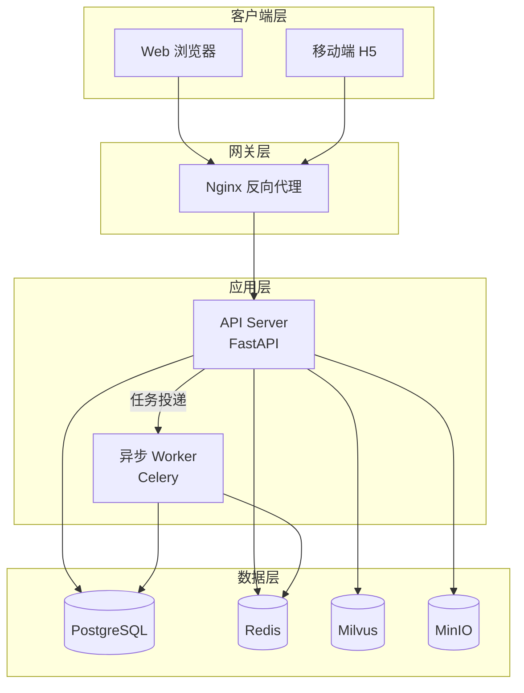

# 技术栈设计文档输出模板

> Kimi 在阶段 5（输出文档）时按需读取本模板，确保输出格式统一。

---

## 文件命名

- **全新设计**：`docs/项目名称-技术栈设计.md`
- **增量更新**：覆盖原文件，并在版本记录中追加一行

---

## 文档结构

```markdown
# [项目名称] 技术栈设计文档

## 版本记录

| 日期 | 版本 | 变更内容 | 关联功能文档 | 作者 |
|------|------|----------|-------------|------|
| YYYY-MM-DD | v1.0 | 初始创建 | [功能文档链接] | Kimi |
| YYYY-MM-DD | v1.1 | 新增 Redis 缓存层、升级数据库至 PostgreSQL | [功能文档链接] | Kimi |

---

## 1. 项目背景与约束

### 1.1 功能需求摘要
- [提炼核心功能，3-5 条]

### 1.2 非功能需求
- **目标并发**：[QPS / 在线用户数]
- **可用性 SLA**：[如 99.9%]
- **数据规模**：[存储量、日增量]
- **合规要求**：[等保、GDPR、数据不出境等]
- **预算约束**：[如有]

### 1.3 团队与运维现状
- **团队规模与技术背景**：[如：5 人全栈，主技术栈 React + Python]
- **部署环境**：[阿里云 / AWS / 自建机房 / 混合云]
- **运维能力**：[无专职运维 / 有 DevOps 团队]

---

## 2. 技术栈概览

| 技术维度 | 选用技术 | 版本建议 | 核心作用 | 变更状态 |
|----------|----------|----------|----------|----------|
| 前端框架 | React | 18.x | UI 交互与状态管理 | 无变更 |
| 前端构建 | Vite | 5.x | 开发服务器与打包 | 无变更 |
| 后端框架 | FastAPI | 0.110+ | API 网关与业务逻辑 | 无变更 |
| 数据库 | PostgreSQL | 16.x | 主数据持久化 | **新增** |
| 缓存 | Redis | 7.x | 会话、限流、热点数据 | **新增** |
| 消息队列 | Redis Stream | 7.x | 异步任务队列 | 无变更 |
| 向量检索 | Milvus | 2.4.x | 知识库语义检索 | **新增** |
| 对象存储 | MinIO | 最新稳定版 | 文件与图片存储 | 无变更 |
| 部署 | Docker Compose | - | 本地开发环境编排 | 无变更 |
| CI/CD | GitHub Actions | - | 自动化测试与构建 | 无变更 |

> **变更状态说明**：仅增量更新时填写。状态值：`无变更` / `新增` / `升级` / `废弃` / `替换为 xxx`

---

## 3. 架构设计

### 3.1 架构分层图（Mermaid）



### 3.2 数据流向说明
1. [描述核心请求的数据流]
2. [描述异步任务的数据流]
3. [描述实时推送的数据流，如有]

---

## 4. 核心功能实现方案

### 4.1 [功能模块 A]

#### 技术支撑
- [引用技术栈中的组件]

#### 实现要点
- **接口设计**：
  - `POST /api/v1/xxx` — [职责说明]
  - `GET /api/v1/xxx/{id}` — [职责说明]
- **数据模型**：
  - [关键表/集合结构，含索引设计]
- **关键逻辑**：
  - [算法、状态机、业务规则]
- **异步流**（如有）：
  - [任务触发条件、消费者逻辑、失败重试策略]

#### 数据模型变更（增量更新时）
- [新增字段 / 新增表 / 索引调整]

---

### 4.2 [功能模块 B]

（同上结构）

---

## 5. 安全设计

| 维度 | 方案 |
|------|------|
| 传输安全 | HTTPS / TLS 1.3 |
| 认证 | JWT (Access + Refresh) |
| 鉴权 | RBAC 角色权限模型 |
| 敏感数据 | 密码 bcrypt 哈希、手机号脱敏 |
| 输入校验 | Pydantic Schema + SQL 参数化 |
| 防刷限流 | Redis + 滑动窗口限流 |

---

## 6. 部署与运维

### 6.1 环境划分
- **开发**：本地 Docker Compose
- **测试**：云服务器单实例
- **生产**：[待补充，如 K8s / 传统服务器集群]

### 6.2 关键配置
- [环境变量清单、密钥管理方案]

### 6.3 监控与告警（如有）
- [日志收集、指标监控、告警规则]

---

## 7. 潜在风险与替代方案

| 风险点 | 影响 | 缓解措施 | 后备方案 |
|--------|------|----------|----------|
| [新技术 X 引入] | 团队学习成本 | 预留 2 周技术预研 | 回退至成熟技术 Y |
| [第三方服务依赖] | 可用性不可控 | 熔断降级 + 本地缓存 | 自托管替代方案 |
| [性能瓶颈] | 高并发下响应延迟 | 压测 + 连接池调优 | 水平扩展 / 引入缓存 |

---

## 8. 决策记录（ADR）

> 记录关键技术选型的决策背景，便于后续追溯。

### ADR-001：[决策标题]
- **背景**：[问题描述]
- **考量选项**：[选项 A / 选项 B]
- **决策**：[最终选择]
- **理由**：[核心原因，3 条以内]
- **后果**：[正面 / 负面]

---

*本文档由 AI 辅助生成，需经技术负责人评审后生效。*
```

---

## 输出检查清单

完成文档前请自检：

1. [ ] 是否区分了全新设计与增量更新场景？
2. [ ] 增量更新时，是否保留了原文档中仍有效的技术决策？
3. [ ] 每项技术选型是否都关联了具体功能需求？
4. [ ] 是否给出了明确的版本建议？
5. [ ] 架构图是否准确反映了数据流向？
6. [ ] 是否包含至少一项风险与后备方案？
7. [ ] 文件路径是否符合命名规范？
