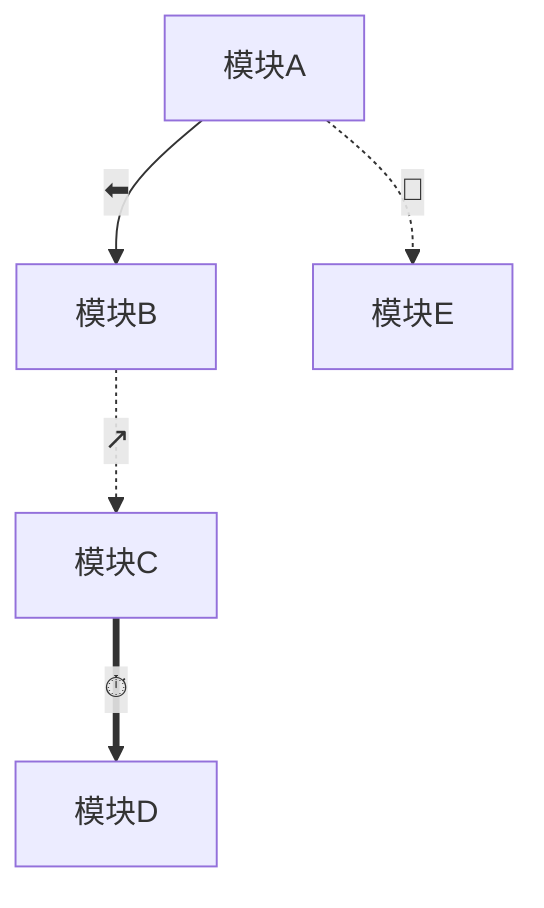
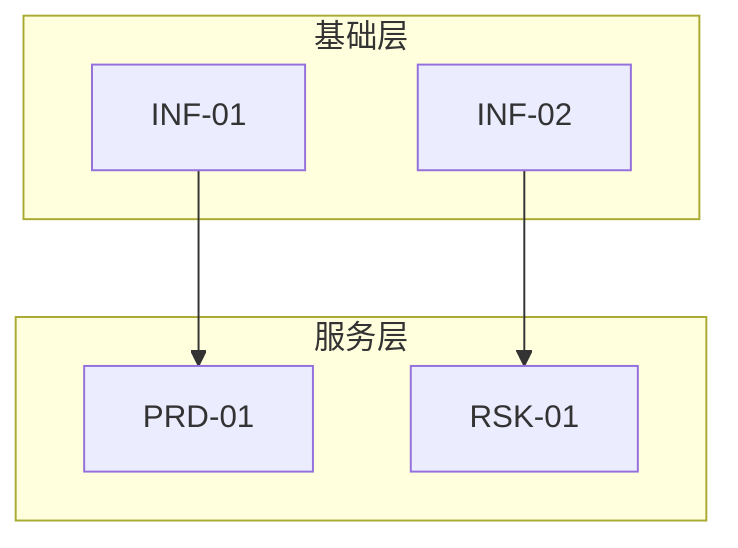

# 模块依赖关系分析输出模板

本参考文件定义 `模块依赖关系分析.md` 的精确结构与质量标准。

## 文档结构

```markdown
# [项目名称] - 模块依赖关系分析

> 生成日期：YYYY-MM-DD
> 源文档：[功能模块全拆解.md]、[项目结构设计文档]
> 模块总数：N
> 识别的依赖关系总数：M（✅ 确定 X 条 / ⚠️ 推断 Y 条 / ❓ 不确定 Z 条）

---

## 一、依赖关系总览

### 1.1 统计数据

| 指标 | 数值 |
|:---|:---:|
| 模块总数 | N |
| 依赖关系总数 | M |
| ✅ 确定依赖 | X |
| ⚠️ 推断依赖 | Y |
| ❓ 不确定依赖 | Z |
| 🔴 循环依赖（如有） | C |
| 平均出度（每个模块依赖多少其他模块） | Avg |
| 平均入度（每个模块被多少其他模块依赖） | Avg |

### 1.2 关键发现摘要

用 3-5 条 bullet 总结最关键的发现：
- 哪个模块是最大枢纽（入度+出度最高）？
- 是否存在关键路径瓶颈？
- 循环依赖的严重程度和影响范围？
- 不确定项是否集中在某个功能域？

---

## 二、依赖列表（按功能域分组）

### 2.1 [功能域 A 名称]

```markdown
| 依赖方 | 被依赖方 | 类型 | 强度 | 推断依据 | 确定性 |
|:---|:---|:---|:---|:---|:---|
| [编号] [名称] | [编号] [名称] | [符号] [类型名] | 强/中/弱 | [文档名] §[章节] 或 基于模块描述推断 — [理由] | ✅/⚠️/❓ |
```

> 分组规则：以依赖方所属功能域为分组依据。若依赖方和被依赖方分属不同功能域，在依赖方所在域列出，并在被依赖方所在域的备注中交叉引用。

### 2.2 [功能域 B 名称]

[重复格式]

---

## 三、Mermaid 依赖图

### 3.1 [功能域 A] 内部依赖图



> 图绘制规则：
> - 仅显示该功能域内的模块，以及它们直接依赖的外部模块（用虚线框标注外部模块所属域）。
> - 边标签使用依赖类型符号（⬅/↗/⏱/🔗）。
> - 循环依赖的节点用 🔴 前缀标注。

### 3.2 [功能域 B] 内部依赖图

[重复格式]

### 3.3 全系统依赖汇总图



> 汇总图使用粗粒度：每个功能域作为一个节点，仅显示域间依赖。若域内循环依赖严重，用 🔴 标注该域。

---

## 四、依赖矩阵

### 4.1 全量依赖矩阵

```markdown
| 模块 | M1 | M2 | M3 | ... |
|:---|:---:|:---:|:---:|:---:|
| M1 | — | ⬅强 | | ... |
| M2 | ↗中 | — | ⏱强 | ... |
| M3 | | | — | ... |
```

> 矩阵规则：
> - 行 = 依赖方，列 = 被依赖方。
> - 单元格内容格式：`[符号][强度]`（例如 `⬅强`）。
> - 对角线留空或用 `—` 表示。
> - 若模块数 >30，按功能域拆分为子矩阵。

### 4.2 功能域间依赖矩阵（粗粒度）

```markdown
| 功能域 | 域A | 域B | 域C | ... |
|:---|:---:|:---:|:---:|:---:|
| 域A | — | 5⬅ 2↗ | 1⏱ | ... |
| 域B | 3↗ | — | 4⬅ | ... |
```

> 粗粒度矩阵格式：`[数量][类型符号]`，表示从行域到列域的该类型依赖有多少条。

---

## 五、实现分层与并行建议

### 5.1 分层表

```markdown
| 层级 | 模块 | 模块类型分布 | 可并行度 | 关键路径节点 | 说明 |
|:---|:---|:---|:---:|:---|:---|
| L1（基础层） | INF-01, INF-02 | 🟢🟢 | 2 | — | 无入向依赖，可完全并行 |
| L2（服务层） | PRD-01, PRD-02, RSK-01 | 🔴🟢🟢 | 3 | PRD-01 | 依赖 L1 |
| L3（业务层） | ORD-01, ORD-02 | 🔴🔴 | 2 | ORD-01 | 依赖 L1+L2 |
```

> 分层规则：
> - L1 = 入度为 0 的模块（无被依赖方）。
> - L(n+1) = 移除 L1..Ln 后，新产生的入度为 0 的模块。
> - 重复直到所有模块都被分配层级。
> - 若因循环依赖无法分层，先打破循环（建议方案），再分层。

### 5.2 关键路径分析

```markdown
| 路径 | 涉及模块 | 总模块数 | 风险说明 |
|:---|:---|:---:|:---|
| 路径 1 | INF-01 → PRD-01 → ORD-01 → RPT-01 | 4 | 包含 2 个 🔴 核心模块，延迟影响最大 |
```

> 关键路径 = 从 L1 到最高层的最长路径（按模块数）。
> 若存在多条等长路径，全部列出。

### 5.3 并行开发建议

用 bullet 列出具体的并行开发策略建议：
- 哪些模块组可以安全地并行开发？
- 哪些模块需要先完成接口契约定义，才能并行？
- 是否有模块可以预先开发 mock/ stub，解除对其他模块的等待？

---

## 六、循环依赖与解耦建议

### 6.1 循环依赖列表

```markdown
| 编号 | 涉及的模块 | 循环类型 | 严重程度 | 建议的打破方案 |
|:---|:---|:---|:---:|:---|
| 1 | A → B → C → A | 三模块循环 | 高 | 引入事件总线，将同步调用改为异步事件 |
| 2 | X ↔ Y | 双向依赖 | 中 | 提取共享接口/抽象层，双方依赖抽象而非具体实现 |
```

### 6.2 解耦建议

对每个循环依赖，详细说明打破方案的可行性和影响范围。

---

## 七、不确定项汇总

```markdown
| 序号 | 依赖关系 | 类型 | 不确定性原因 | 建议确认的问题 | 相关文档 |
|:---|:---|:---|:---|:---|:---|
| 1 | ORD-01 → PRD-03 | ⬅ | 设计文档提到"商品信息"但未明确是库存还是详情 | 订单创建时是否需要实时查询商品详情？ | 设计文档 §4.1 |
| 2 | PAY-01 → TAX-01 | ↗ | 未找到税务模块的明确描述 | 税金计算是否由支付模块内部处理？ | — |
```

> 排序规则：按严重程度排序（❓ 不确定优先于 ⚠️ 推断）。
> 对于 ❓ 项，必须在"建议确认的问题"中给出具体的、可操作的确认问题，而非泛泛而谈。

---

## 附录 A：依赖类型图例

| 符号 | 类型 | 含义 | 示例 |
|:---|:---|:---|:---|
| ⬅ | 数据依赖 | 模块 A 需要模块 B 产生的数据 | 订单需要商品库存数据 |
| ↗ | 调用依赖 | 模块 A 调用模块 B 的接口 | 支付调用风控验证 |
| ⏱ | 时序依赖 | 模块 A 必须在 B 之后部署/初始化 | 数据库迁移先于数据访问层 |
| 🔗 | 共享资源依赖 | A 和 B 共享同一资源 | 两个模块共用 Redis 缓存 |

## 附录 B：推断方法论说明

简要说明本次分析中使用的推断策略，帮助读者理解哪些依赖是强推断、哪些是弱推断：
- 显式提取：从设计文档中直接读取的依赖关系。
- 功能推断：基于模块核心功能的语义分析推断的依赖。
- 架构推断：基于分层架构原则（如表现层依赖逻辑层）推断的依赖。

## 附录 C：变更追踪

若本文件是更新版本，记录本次变更：
- 版本号 / 日期
- 新增/修改/删除了哪些依赖关系
- 变更原因（设计文档更新、用户反馈等）
