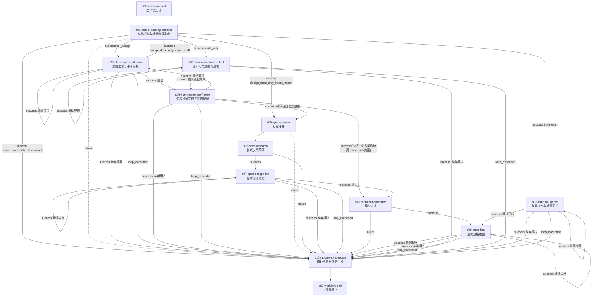

# module-design-pipeline@1.0.0

> 存量检测 -> 增量路径判定 -> 意图编写/逆向工程/差异对比 -> 规格编写 -> 契约协调 -> 同步上报

---

## 工作流概览

- **工作流 ID**：`module-design-pipeline`
- **版本**：`1.0.0`
- **Stage 数量**：13（含 2 个虚拟 stage）
- **确认点数量**：6（由 edges 中 `success` + `choice` 模式隐式定义）
- **最大并发**：1（模块内阶段串行执行）
- **父工作流**：`project-design-pipeline@3.1.0`（s08 调度）

### 适用场景

本工作流作为 `project-design-pipeline@3.1.0` 的子工作流运行，每个实例对应一个模块的设计。支持 6 种增量场景：

1. **full_design** -- 模块从零开始，完整走意图编写 + 规格编写
2. **design_docs_only_intent_frozen** -- 意图已冻结，只需补充规格文档
3. **design_docs_only_all_complete** -- 设计文档已齐全，仅上报同步状态
4. **design_docs_only_intent_draft** -- 意图草稿存在但未冻结，续写意图
5. **code_only** -- 无设计文档有代码，从代码逆向推导意图
6. **both_exist** -- 设计文档和代码均存在，diff 对比增量更新

### v1.0.0 规范同步更新（2026-05-25）

| 维度 | 变更前 | 变更后 |
|------|--------|--------|
| edges `condition` 值 | 使用已废弃的 `confirmed` / `rejected` | 统一使用 `success` + `choice` |
| stage `confirmation_point` 字段 | 每个 stage 显式声明 | 移除（确认现在是 Skill 内部行为） |

---

## 流程图

