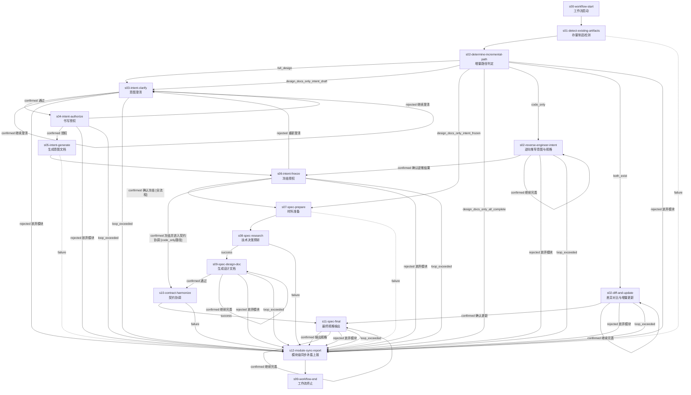

# module-design-pipeline@1.0.0

> 存量检测 -> 增量路径判定 -> 意图编写/逆向工程/差异对比 -> 规格编写 -> 契约协调 -> 同步上报

---

## 工作流概览

- **工作流 ID**：`module-design-pipeline`
- **版本**：`1.0.0`
- **Stage 数量**：16（含 2 个虚拟 stage）
- **确认点数量**：8
- **最大并发**：1（模块内阶段串行执行）
- **父工作流**：`project-design-pipeline@3.0.0`（s07 调度）

### 适用场景

本工作流作为 `project-design-pipeline@3.0.0` 的子工作流运行，每个实例对应一个模块的设计。支持 6 种增量场景：

1. **full_design** -- 模块从零开始，完整走意图编写 + 规格编写
2. **design_docs_only_intent_frozen** -- 意图已冻结，只需补充规格文档
3. **design_docs_only_all_complete** -- 设计文档已齐全，仅上报同步状态
4. **design_docs_only_intent_draft** -- 意图草稿存在但未冻结，续写意图
5. **code_only** -- 无设计文档有代码，从代码逆向推导意图
6. **both_exist** -- 设计文档和代码均存在，diff 对比增量更新

---

## 流程图

---

## Stage 说明

### s00-workflow-start -- 工作流启动

虚拟起始点，无条件流转到下游。

---

### s01-detect-existing-artifacts -- 存量制品检测

- **Skill**：`existing-artifact-detector`（NEW）
- **确认点**：否
- **重试**：1 次（耗尽后沿 `failure` edge → s12 上报已有结果）
- **描述**：扫描当前模块目录，检测已有制品：
  - 意图文档（`docs/功能设计/[分组]/[模块]/[模块]-意图文档.md`）
  - 设计文档（`docs/功能设计/[分组]/[模块]/[模块]-设计文档.md`）
  - 落地规范（`docs/功能设计/[分组]/[模块]/[模块]-落地规范.md`）
  - 契约文件（`contracts/` 下对应模块的接口定义）
  - 源代码（`src/` 下对应模块的实现代码）
  - 同步问题记录（`docs/功能设计/[分组]/[模块]/_sync-issues.md`）
- **输出**：存量制品清单（注入 s02 上下文）

---

### s02-determine-incremental-path -- 增量路径判定

- **Skill**：`existing-artifact-detector`（NEW）
- **确认点**：是
- **描述**：根据 s01 的检测结果，判定并推荐增量路径。用户确认后路由到对应下游：
  - `full_design`：无任何设计文档和代码
  - `design_docs_only_intent_draft`：意图文档存在但未冻结
  - `design_docs_only_intent_frozen`：意图已冻结，缺规格文档
  - `design_docs_only_all_complete`：设计文档齐全，仅需上报
  - `code_only`：无设计文档但代码已存在
  - `both_exist`：设计文档和代码均存在
  - **放弃模块**（rejected）：放弃本模块设计 → s12 上报后终止
- **输出**：选定的增量路径 + 上下文摘要

---

### s02-reverse-engineer-intent -- 逆向推导意图与规格

- **Skill**：`code-reverse-engineering-writer`（NEW）
- **确认点**：是
- **触发条件**：`code_only`
- **描述**：从现有代码逆向推导模块意图和接口规格。分析代码结构、函数签名、类型定义、状态机，生成意图文档和接口草案。
- **输出**：逆向推导的意图文档 + 接口类型草案

---

### s02-diff-and-update -- 差异对比与增量更新

- **Skill**：`design-code-diff-updater`（NEW）
- **确认点**：是
- **触发条件**：`both_exist`
- **描述**：对比已有设计文档与实际代码实现，检测偏离。更新设计文档以反映代码变更，或标记代码中偏离设计的部分等待用户裁决。
- **输出**：差异报告 + 更新后的设计文档/标记

---

### s03-intent-clarify -- 意图澄清

- **Skill**：`module-intent-writer`（现有，从 v2.1.1 继承）
- **确认点**：是
- **触发条件**：`full_design`, `design_docs_only_intent_draft`
- **描述**：多轮问答澄清业务需求。核心模块深入多轮，一般模块快速确认。每轮产出澄清记录，标注未决问题。
- **输出**：澄清共识记录

---

### s04-intent-authorize -- 书写授权

- **Skill**：`module-intent-writer`（现有）
- **确认点**：是
- **触发条件**：`full_design`, `design_docs_only_intent_draft`
- **描述**：汇总澄清阶段的共识，请求用户授权开始书写意图文档。授权被拒则回到 s03 继续澄清。
- **输出**：授权状态

---

### s05-intent-generate -- 生成意图文档

- **Skill**：`module-intent-writer`（现有）
- **确认点**：否
- **重试**：1 次（耗尽后沿 `failure` edge → s12 上报已有结果）
- **触发条件**：`full_design`, `design_docs_only_intent_draft`
- **描述**：按模板生成意图文档，路径严格遵守 directory-convention.md：`docs/功能设计/[序号]-[分组]/[编号]-[名称]/[编号]-[名称]-意图文档.md`。
- **输出**：`docs/功能设计/[分组]/[模块]/[模块]-意图文档.md`

---

### s06-intent-freeze -- 冻结授权

- **Skill**：`module-intent-writer`（现有）
- **确认点**：是
- **触发条件**：`full_design`, `design_docs_only_intent_draft`, `code_only`
- **描述**：呈现意图文档，请求用户冻结确认。这是最重要的门控——冻结后方可进入规格编写阶段。`code_only` 路径的 s02-re 完成后也汇入此阶段冻结逆推结果。
- **路由差异**：
  - 全流程路径：confirmed -> s07（规格准备）
  - code_only 路径：confirmed -> s10（契约协调，跳过规格准备/预研/设计文档）
- **输出**：冻结确认 + 锁定意图文档

---

### s07-spec-prepare -- 材料准备

- **Skill**：`module-spec-writer`（现有，从 v2.1.1 继承）
- **确认点**：否
- **重试**：1 次（耗尽后沿 `failure` edge → s12 上报已有结果）
- **触发条件**：`full_design`, `design_docs_only_intent_frozen`
- **描述**：定位所有输入材料路径（已冻结的意图文档、全局设计文档、契约索引），验证路径合法性和文件完整性。
- **输出**：材料清单 + 路径验证结果

---

### s08-spec-research -- 技术决策预研

- **Skill**：`spec-researcher`（现有，从 v2.1.1 继承）
- **确认点**：否
- **重试**：1 次
- **触发条件**：`full_design`, `design_docs_only_intent_frozen`
- **描述**：独立 SubAgent 读取全部设计文档，做出技术决策，标记必须由用户裁决的业务矛盾点。输出《技术决策完整报告》。
- **输出**：技术决策完整报告（含业务矛盾标注）

---

### s09-spec-design-doc -- 生成设计文档

- **Skill**：`module-spec-writer`（现有）
- **确认点**：是
- **触发条件**：`full_design`, `design_docs_only_intent_frozen`
- **描述**：基于技术决策报告生成设计文档。若有业务矛盾则内嵌 PENDING_CONFIRM 请用户裁决。
- **输出**：`docs/功能设计/[分组]/[模块]/[模块]-设计文档.md`

---

### s10-contract-harmonize -- 契约协调

- **Skill**：`contract-harmonizer`（现有，从 v2.1.1 继承）
- **确认点**：否
- **重试**：1 次
- **触发条件**：`full_design`, `design_docs_only_intent_frozen`, `code_only`
- **描述**：提取模块对外接口类型草案，扫描项目中已有契约文件，检查命名冲突、语义冲突及可复用共享类型，输出精确协调报告。
- **输出**：契约协调报告

---

### s11-spec-final -- 最终规格输出

- **Skill**：`module-spec-writer`（现有）
- **确认点**：是
- **触发条件**：`full_design`, `design_docs_only_intent_frozen`, `code_only`, `both_exist`
- **描述**：基于设计文档和契约协调报告生成落地规范。若有契约冲突则内嵌 PENDING_CONFIRM 请用户裁决。通过后更新契约索引。
- **输出**：`docs/功能设计/[分组]/[模块]/[模块]-落地规范.md` + 契约文件更新

---

### s12-module-sync-report -- 模块级同步矛盾上报

- **Skill**：`module-sync-reporter`（NEW）
- **确认点**：否
- **描述**：汇总本模块设计过程中的所有同步矛盾（契约冲突、跨模块类型不匹配、设计偏离等），按 `sync-issues-format.md` 格式生成报告，供父工作流 s08 聚合使用。
- **注意**：本 stage 也是所有模块级 `loop_exceeded` 和 `放弃模块` 的汇聚点，确保失败模块在终止前也能上报状态。
- **输出**：`docs/功能设计/[分组]/[模块]/_sync-issues.md`

### s99-workflow-end -- 工作流终止

虚拟终止点，子工作流实例结束。父工作流 s07 检测到子实例终止后执行 git merge。

---

## Skill 清单

| Skill ID | 名称 | 使用 Stage | 状态 |
|----------|------|-----------|------|
| `existing-artifact-detector` | 存量制品检测器 | s01, s02 | **NEW** |
| `code-reverse-engineering-writer` | 代码逆向推导编写器 | s02-re | **NEW** |
| `design-code-diff-updater` | 设计代码差异更新器 | s02-diff | **NEW** |
| `module-intent-writer` | 模块意图编写器 | s03, s04, s05, s06 | 现有（从 v2.1.1 继承） |
| `module-spec-writer` | 模块规格编写器 | s07, s09, s11 | 现有（从 v2.1.1 继承） |
| `spec-researcher` | 技术决策预研器 | s08 | 现有（从 v2.1.1 继承） |
| `contract-harmonizer` | 契约协调器 | s10 | 现有（从 v2.1.1 继承） |
| `module-sync-reporter` | 模块同步上报器 | s12 | **NEW** |

---

## 增量场景路由表

| 场景 | s01 检测结果 | s02 路由 | 实际执行路径 |
|------|-------------|---------|------------|
| `full_design` | 无文档、无代码 | s03 | s03->s04->s05->s06->s07->s08->s09->s10->s11->s12->s99 |
| `design_docs_only_intent_draft` | 有意图草稿、未冻结 | s03 | 同 full_design（续写意图） |
| `design_docs_only_intent_frozen` | 意图已冻结、缺规格 | s07 | s07->s08->s09->s10->s11->s12->s99 |
| `design_docs_only_all_complete` | 意图+规格齐全 | s12 | s12->s99（仅上报） |
| `code_only` | 无文档、有代码 | s02-re | s02-re->s06->s10->s11->s12->s99 |
| `both_exist` | 有文档、有代码 | s02-diff | s02-diff->s11->s12->s99 |

---

## 共享资源

（继承自父工作流的 `.claude/workflows/project-design-pipeline/` 目录，worktree 自动携带 `.claude/`）

| 路径 | 类型 | 说明 |
|------|------|------|
| `.claude/workflows/project-design-pipeline/references/directory-convention.md` | 规范 | 全局目录结构约定（路径格式硬性约束） |
| `.claude/workflows/project-design-pipeline/references/sync-issues-format.md` | 规范 | 同步矛盾上报格式 |
| `.claude/workflows/project-design-pipeline/scripts/get_timestamp.py` | 脚本 | 时间戳生成工具 |

---

## 故障与回退机制

### 循环超限（loop_exceeded）

模块级所有确认点的 `loop_exceeded` 均路由到 `s12-module-sync-report`（而非直接 `s99`），确保失败模块向父工作流上报状态后再终止。

### 放弃模块

各确认点提供"放弃模块"选项，路由到 s12 报告当前状态后终止。s02（增量路径判定）的 `rejected` 出口同样为"放弃模块"→ s12。父工作流 s07 将"放弃"视为一种正常退出（非 ERROR），已完成的阶段产出保留。

### 非确认点失败

s01（存量检测）、s05（生成意图）、s07（材料准备）、s08（技术预研）、s10（契约协调）为非确认点，执行失败后沿 `failure` edge 路由到 s12 上报失败原因后终止。父工作流 s07 检测到子工作流失效后可让用户决定是否重试或跳过。

### 阶段级重试

s01、s05、s07、s08、s10 配置了 `retry: 1`，执行失败后自动重试 1 次。重试耗尽后沿 `failure` edge 降级至 s12。重试仍在同一 worktree 中进行，SubAgent 可看到上次执行的遗留文件。
