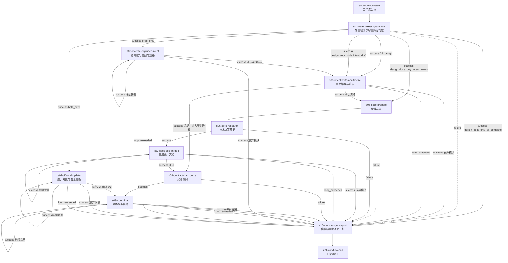

# module-design-pipeline@1.1.0

> 存量检测 -> 增量路径判定 -> 意图编写与冻结 / 逆向工程 / 差异对比 -> 规格编写 -> 契约协调 -> 同步上报

---

## 工作流概览

- **工作流 ID**：`module-design-pipeline`
- **版本**：`1.1.0`
- **Stage 数量**：12（含 2 个虚拟 stage，实际执行 Stage 10 个）
- **确认点数量**：4（由 edges 中 `success` + `choice` 模式隐式定义；意图编写阶段的确权循环已下沉为 Skill 内部行为）
- **最大并发**：1（模块内阶段串行执行）
- **父工作流**：`project-design-pipeline@3.1.0`（s08 调度）

### 适用场景

本工作流作为 `project-design-pipeline@3.1.0` 的子工作流运行，每个实例对应一个模块的设计。支持 6 种增量场景：

1. **full_design** -- 模块从零开始，完整走意图编写 + 规格编写
2. **design_docs_only_intent_frozen** -- 意图已冻结，只需补充规格文档
3. **design_docs_only_all_complete** -- 设计文档已齐全，仅上报同步状态
4. **design_docs_only_intent_draft** -- 意图草稿存在但未冻结，续写意图
5. **code_only** -- 无设计文档有代码，从代码逆向推导意图
6. **both_exist** -- 设计文档和代码均存在，diff 对比增量更新

---

## Stage 详解

### s00-workflow-start / s99-workflow-end

虚拟起止节点，不承载实际 Skill。用于 DAG 入口/出口锚定和父工作流挂接。

---

### s01-detect-existing-artifacts：存量检测与增量路径判定

- **Skill**：`existing-artifact-detector`
- **职责**：扫描模块目录下的已有制品（意图文档、设计文档、落地规范、契约文件、源代码、同步问题），判定增量设计场景，推荐最佳路由路径。
- **输入**：模块标识（`module_id`、`module_name`、`group`）、设计状态列（如有）
- **输出**：`.tmp/artifact-manifest.json`（制品清单）、`.tmp/route-decision.json`（路由决策）
- **确认点**：否。Skill 自主完成扫描与判定，以 `DONE --choice <scene>` 上报路由决策，由 edges 分发。
- **失败路径**：`failure` → s10（上报异常状态后结束）
- **路由出口**：6 条 `success + choice` 边，分别指向 s03、s05、s10、s02-re、s02-diff

---

### s02-reverse-engineer-intent：逆向推导意图与规格

- **Skill**：`code-reverse-engineering-writer`
- **职责**：当模块仅有代码无设计文档时，从源代码逆向提取数据模型、公共接口、状态机和业务逻辑，重建意图文档（草稿）和规格草案。
- **输入**：源代码路径列表、已有制品清单、项目技术栈方案
- **输出**：意图文档（草稿）、落地规范（草案）、`.tmp/reverse-engineering-summary.md`
- **确认点**：是。用户审阅逆向推导摘要后选择"确认逆推结果"、"继续完善"或"放弃模块"。
- **自循环**：`继续完善` 支持最多 3 轮循环
- **出口**：确认后汇入 s03 进行冻结授权；放弃模块或循环超限 → s10

---

### s02-diff-and-update：差异对比与增量更新

- **Skill**：`design-code-diff-updater`
- **职责**：当设计文档和代码同时存在时，逐字段对比两者差异，分类归因（有意演进 / 意外漂移 / 文档错误 / 代码过期 / 未知），增量更新设计文档。
- **输入**：已有制品清单中的文档路径和代码路径
- **输出**：`.tmp/diff-report.md`、更新后的设计文档、`.tmp/fix-recommendations.md`
- **确认点**：是。用户审阅差异报告后选择"确认更新"、"继续完善"或"放弃模块"。
- **自循环**：`继续完善` 支持最多 3 轮循环
- **出口**：确认后跳过意图编写和规格准备，直接进入 s09 最终规格输出；放弃模块或循环超限 → s10

---

### s03-intent-write-and-freeze：意图编写与冻结

- **Skill**：`module-intent-writer`
- **职责**：将功能模块转化为业务意图文档，经多轮澄清、书写授权、文档生成、冻结授权后锁定为不可变基线。
- **输入**：模块标识、增量模式（`full_design` / `design_docs_only_intent_draft`）、功能模块全拆解表、全局设计文档、契约索引
- **输出**：意图文档（`[编号]-[名称]-意图文档.md`，状态从草稿到已冻结）
- **确认点**：是，但**下沉为 Skill 内部行为**。Skill 内部通过多轮 `AskUserQuestion + continue` 完成：
  1. 意图澄清（多轮问答）
  2. 书写授权（AskUserQuestion：授权 / 继续澄清 / 放弃模块）
  3. 生成意图文档（WriteFile 落盘）
  4. 冻结授权（AskUserQuestion：确认冻结 / 冻结并进入契约协调 / 重新澄清 / 放弃模块）
- **循环控制**：`继续澄清` 和 `重新澄清` 在 Skill 内部通过 continue 实现，不再占用 Stage 边界自循环。
- **出口**：
  - `确认冻结` → s05（全流程 / intent_draft 路径）
  - `冻结并进入契约协调` → s08（code_only 路径，跳过规格准备/预研/设计文档）
  - `放弃模块` 或 `loop_exceeded` → s10

> **v1.1.0 变更**：原 v1.0.0 将意图编写拆分为 s03（澄清+授权）和 s04（生成+冻结）两个 Stage。经 stage-splitter 评估，二者使用同一 Skill、共享同一推理上下文、无 DAG 路由需求，属于过度拆分。合并后减少 1 次 SubAgent 冷启动和 1 次 wfctl 往返。

---

### s05-spec-prepare：材料准备

- **Skill**：`module-spec-writer`（步骤 1）
- **职责**：验证输入完备性（意图文档已冻结、无意图缺陷），收集材料路径，执行项目级一致性扫描，将发现的问题追加写入全局 `_sync-issues.md`。
- **输入**：模块标识、增量模式、已冻结意图文档路径
- **输出**：材料清单、意图缺陷结论、同步检查摘要
- **确认点**：否
- **出口**：`success` → s06；`failure` → s10

---

### s06-spec-research：技术决策预研

- **Skill**：`spec-researcher`
- **职责**：作为独立技术决策子代理，读取全部项目设计文档，做出技术上最优的决策，标记必须由用户裁决的业务矛盾点，输出《技术决策完整报告》。
- **输入**：模块标识、上游文件路径（意图文档、全局设计文档、契约索引等）、增量模式标记
- **输出**：`.tmp/reports/tech-decision-report-<module_id>.md`
- **确认点**：否。技术矛盾标记为业务矛盾，由下游 Stage 或用户裁决。
- **出口**：`success` → s07；`failure` → s10

---

### s07-spec-design-doc：生成设计文档

- **Skill**：`module-spec-writer`（步骤 2）
- **职责**：基于技术决策报告生成/更新设计文档（瘦身版），聚焦技术实现思路、架构权衡、兼容性分析、设计原则兑现。
- **输入**：技术决策报告、用户历史裁决反馈
- **输出**：`[编号]-[名称]-设计文档.md`
- **确认点**：是。用户审阅后选择"通过"、"继续完善"或"放弃模块"。
- **自循环**：`继续完善` 支持最多 3 轮循环
- **出口**：`通过` → s08；放弃模块或循环超限 → s10

---

### s08-contract-harmonize：契约协调

- **Skill**：`contract-harmonizer`
- **职责**：从设计文档提取对外接口类型草案，扫描已有契约文件，检测命名冲突、语义冲突及可复用共享类型，输出《契约协调报告》。
- **输入**：设计文档路径、已有契约文件
- **输出**：`.tmp/contract-harmonize-report.json`
- **确认点**：否。冲突只发现不仲裁，由下游 Stage 或用户裁决。
- **出口**：`success` → s09；`failure` → s10

---

### s09-spec-final：最终规格输出

- **Skill**：`module-spec-writer`（步骤 3）
- **职责**：基于设计文档和契约协调报告，生成落地规范、写入契约文件、更新索引。区分对外接口章节（`【已锁定】`）和内部实现章节（`【对内实现】`）。
- **输入**：契约协调报告、设计文档、用户历史裁决反馈
- **输出**：落地规范、契约 JSON 文件、`_index.json` 更新、`_contracts.md` 更新
- **确认点**：是。用户终审后选择"输出规格"、"继续完善"或"放弃模块"。
- **自循环**：`继续完善` 支持最多 3 轮循环
- **出口**：`输出规格` → s10；放弃模块或循环超限 → s10

---

### s10-module-sync-report：模块级同步矛盾上报

- **Skill**：`module-sync-reporter`
- **职责**：收集本模块设计生命周期中出现的所有同步矛盾，按类型和严重程度分类，以结构化格式追加写入模块级 `_sync-issues.md`。
- **输入**：模块标识、增量场景类型、各阶段输出路径汇总
- **输出**：`docs/功能设计/[序号]-[分组]/[编号]-[名称]/_sync-issues.md`
- **确认点**：否。纯记录上报，不与用户交互。
- **出口**：`always` → s99

---

## 流程图

---

## 变更日志

### v1.1.0（2026-05-26）

| 维度 | 变更内容 | 影响 |
|------|---------|------|
| Stage 合并 | s03（意图澄清与书写授权）+ s04（生成意图文档与冻结授权）→ **s03-intent-write-and-freeze**（意图编写与冻结） | Stage 数量 11→10，消除 1 次上下文断裂和 1 次 wfctl 往返 |
| 确认点下沉 | 意图编写阶段的多轮循环（继续澄清 / 重新澄清）从 Stage 边界自循环下沉为 **Skill 内部 AskUserQuestion + continue** | 减少 Stage 边界确认点 2 个，Skill 内部交互连续性提升 |
| edges 调整 | s02-re 出口由 s04 改为 **s03**；s03 出口保留 `确认冻结`→s05、`冻结并进入契约协调`→s08、`放弃模块`→s10 | 兼容全部 6 种增量路径 |
| WORKFLOW.md | 补全全部 Stage 的职责、输入输出、确认点、出口说明；更新 Mermaid 流程图 | 文档完整性提升 |

### v1.0.0（2026-05-25）

| 维度 | 变更前 | 变更后 |
|------|--------|--------|
| edges `condition` 值 | 使用已废弃的 `confirmed` / `rejected` | 统一使用 `success` + `choice` |
| stage `confirmation_point` 字段 | 每个 stage 显式声明 | 移除（确认现在是 Skill 内部行为） |
