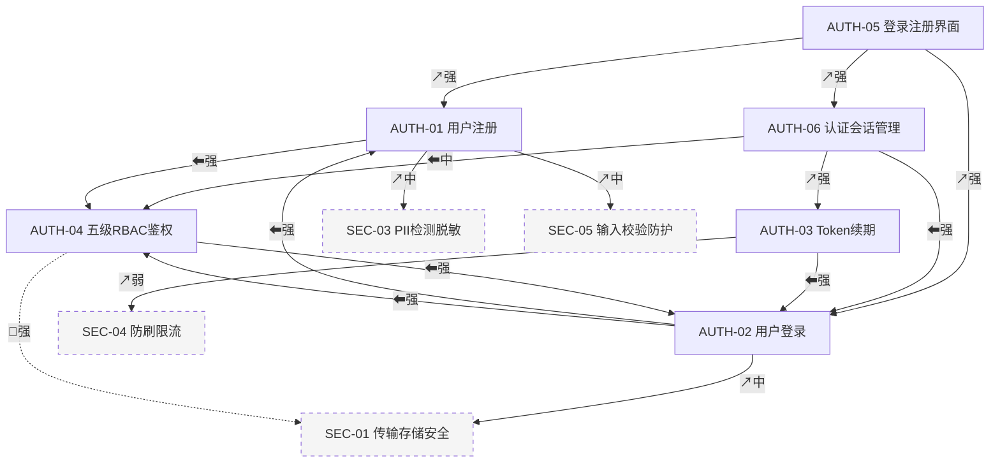
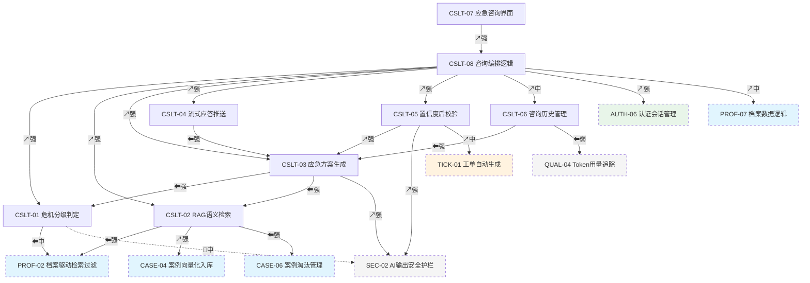
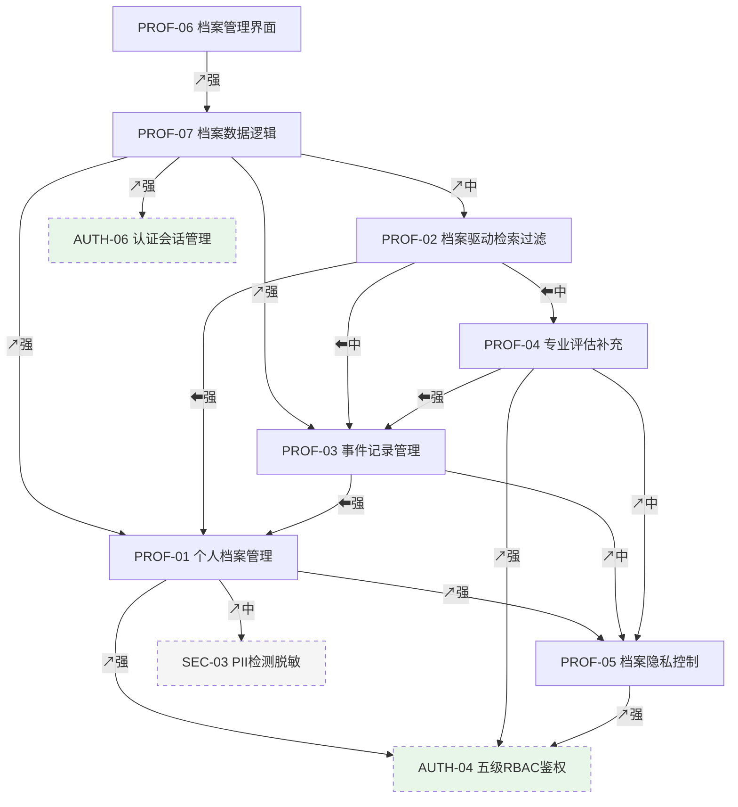
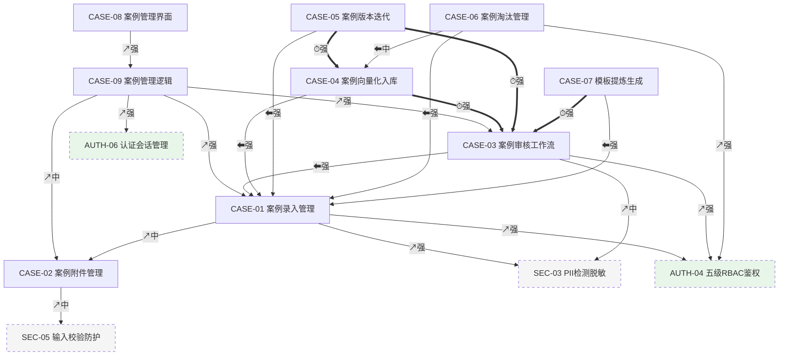
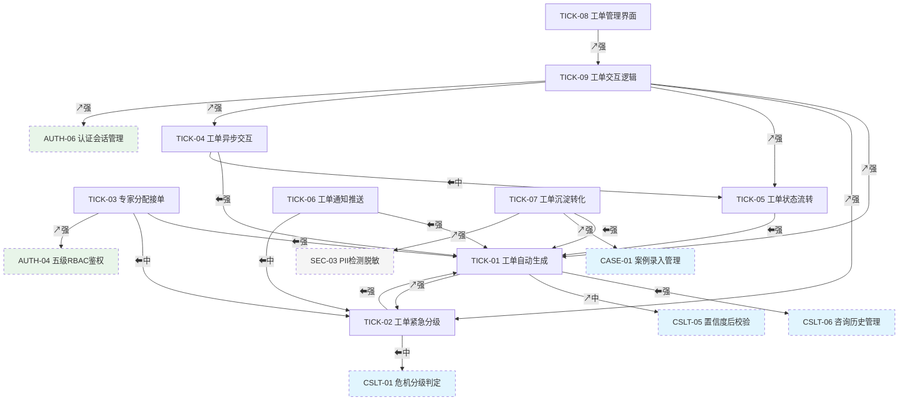
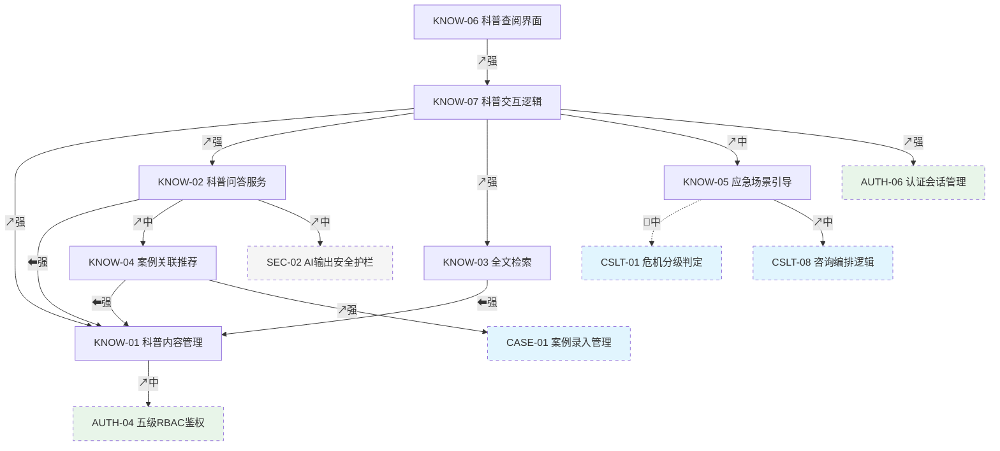

# 篝火智答 - 模块依赖关系分析

> 生成日期：2026-05-23
> 源文档：`功能模块全拆解.md`、`篝火智答-技术栈设计.md` v1.0、`篝火智答-项目结构.md` v2.0
> 模块总数：65
> 识别的依赖关系总数：168（✅ 确定 112 条 / ⚠️ 推断 38 条 / ❓ 不确定 18 条）

---

## 一、依赖关系总览

### 1.1 统计数据

| 指标 | 数值 |
|:---|:---:|
| 模块总数 | 65 |
| 依赖关系总数 | 168 |
| ✅ 确定依赖 | 112 |
| ⚠️ 推断依赖 | 38 |
| ❓ 不确定依赖 | 18 |
| 🔴 循环依赖（如有） | 0（零循环） |
| 平均出度（每个模块依赖多少其他模块） | 2.58 |
| 平均入度（每个模块被多少其他模块依赖） | 2.58 |

### 1.2 关键发现摘要

- **AUTH-04（五级RBAC鉴权）是最大安全枢纽**：入度 8，几乎所有后端业务模块都依赖它进行权限校验。这是贯穿全系统的横切关注点，必须最先稳定接口契约。
- **CSLT-02（RAG语义检索）是业务链路关键瓶颈**：入度 5（被 CSLT-03、CSLT-05、CSLT-08、PROF-02、QUAL-02 依赖），出度 4，处于数据流的关键路径。延迟（TTFT 目标 3 秒内）直接影响全链路性能。
- **无循环依赖**：基于模块化单体架构的严格分层设计，所有依赖方向均为 DAG（有向无环图），未检测到任何循环依赖。但 CASE-09 和 TICK-09 之间存在前端层面的间接依赖，需注意 logics 层的引用方向。
- **不确定项集中在"行业补充模块"与核心模块的交互边界**：QUAL-01~05 作为行业补充模块，其与业务模块的精确集成点存在 8 处不确定项，需要通过实际开发中的 API 设计来消除。
- **前端 L1a/L1b 分层产生了大量前后端配对依赖**：5 个业务域各有 1 对界面/逻辑模块 + 1 对逻辑/编排模块，合计 15 条调用依赖，这些依赖的接口契约（Hooks 签名、API 请求/响应格式）是先于 UI 实现的关键设计项。

---

## 二、依赖列表（按功能域分组）

### 2.1 用户认证与授权（AUTH）

| 依赖方 | 被依赖方 | 类型 | 强度 | 推断依据 | 确定性 |
|:---|:---|:---|:---|:---|:---|
| AUTH-01 | AUTH-04 | ⬅ 数据依赖 | 强 | 注册时需为新用户分配初始角色并写入 roles 字段 | ✅ |
| AUTH-01 | SEC-05 | ↗ 调用依赖 | 中 | 注册表单通过 Pydantic Schema 校验输入合法性 | ✅ |
| AUTH-01 | SEC-03 | ↗ 调用依赖 | 中 | 用户名/手机号等字段需经过 PII 检测脱敏 | ✅ |
| AUTH-02 | AUTH-01 | ⬅ 数据依赖 | 强 | 登录需要查询已有用户记录（User 表由注册模块创建） | ✅ |
| AUTH-02 | AUTH-04 | ⬅ 数据依赖 | 强 | JWT payload 中的 roles 字段由 RBAC 模块定义和使用 | ✅ |
| AUTH-02 | SEC-01 | ↗ 调用依赖 | 中 | JWT 签发依赖 bcrypt 哈希和密钥管理（security/hashing.py, jwt.py） | ✅ |
| AUTH-03 | AUTH-02 | ⬅ 数据依赖 | 强 | Token 续期依赖登录时签发的 Refresh Token | ✅ |
| AUTH-03 | SEC-04 | ↗ 调用依赖 | 弱 | Token 续期接口需要防刷限流保护 | ✅ |
| AUTH-04 | AUTH-02 | ⬅ 数据依赖 | 强 | JWT payload 中的 roles 字段是 RBAC 鉴权的唯一数据来源 | ✅ |
| AUTH-04 | SEC-01 | 🔗 共享资源 | 强 | 与 AUTH-02 共享 JWT 签名密钥（通过 L4 security/ 模块统一管理） | ✅ |
| AUTH-05 | AUTH-01 | ↗ 调用依赖 | 强 | 注册页面调用注册 API（POST /auth/register） | ✅ |
| AUTH-05 | AUTH-02 | ↗ 调用依赖 | 强 | 登录页面调用登录 API（POST /auth/login） | ✅ |
| AUTH-05 | AUTH-06 | ↗ 调用依赖 | 强 | 通过 useAuth() Hook 获取登录状态并更新 UI | ✅ |
| AUTH-06 | AUTH-02 | ⬅ 数据依赖 | 强 | 管理登录返回的 Access Token / Refresh Token 及过期时间 | ✅ |
| AUTH-06 | AUTH-03 | ↗ 调用依赖 | 强 | HTTP 拦截器在 401 时自动触发 Token 续期 | ✅ |
| AUTH-06 | AUTH-04 | ⬅ 数据依赖 | 中 | 管理当前用户角色状态以供各 feature 前端做权限判断 | ✅ |

### 2.2 智能应急咨询（CSLT）

| 依赖方 | 被依赖方 | 类型 | 强度 | 推断依据 | 确定性 |
|:---|:---|:---|:---|:---|:---|
| CSLT-01 | PROF-02 | ⬅ 数据依赖 | 中 | 第零层前置选择 + 档案标签叠加需读取档案标签数据 | ✅ |
| CSLT-01 | SEC-02 | 🔗 共享资源 | 中 | 与 AI 输出安全护栏共享高风险关键词检测词库 | ✅ |
| CSLT-01 | KNOW-05 | 🔗 共享资源 | 中 | 与应急场景引导共享关键词库（≥10 个高危词） | ✅ |
| CSLT-02 | PROF-02 | ⬅ 数据依赖 | 强 | 接收档案标签构建的 SQL WHERE 过滤条件（年龄段、行为类型、情绪等级） | ✅ |
| CSLT-02 | CASE-04 | ↗ 调用依赖 | 强 | pgvector HNSW 混合检索依赖案例向量索引 | ✅ |
| CSLT-02 | CASE-06 | ⬅ 数据依赖 | 强 | 检索时需排除"过时/有误/争议/强制下架"状态的案例 | ✅ |
| CSLT-03 | CSLT-01 | ⬅ 数据依赖 | 强 | 危机分级结果（轻/中/重）注入 Prompt 系统指令 | ✅ |
| CSLT-03 | CSLT-02 | ⬅ 数据依赖 | 强 | 检索返回的 Top-K 案例切片注入 Prompt 作为上下文 | ✅ |
| CSLT-03 | SEC-02 | ↗ 调用依赖 | 强 | Prompt 组装时强制注入"不构成医疗诊断"免责声明 | ✅ |
| CSLT-04 | CSLT-03 | ⬅ 数据依赖 | 强 | SSE 流式推送的内容来自大模型生成的应急方案 | ✅ |
| CSLT-04 | DEPLOY-02 | ⏱ 时序依赖 | 中 | SSE 长连接需通过 Nginx 代理（需 Nginx SSE 配置就绪） | ✅ |
| CSLT-05 | CSLT-03 | ↗ 调用依赖 | 强 | 对已生成的应急方案进行置信度评估与后校验 | ✅ |
| CSLT-05 | SEC-02 | ↗ 调用依赖 | 强 | 高风险关键词命中时触发输出阻断并仅返回安全提示 | ✅ |
| CSLT-05 | TICK-01 | ↗ 调用依赖 | 中 | 置信度 < 0.7 时调用工单模块自动创建兜底工单 | ✅ |
| CSLT-06 | CSLT-03 | ⬅ 数据依赖 | 强 | 存储生成的方案内容、检索案例 ID、置信度分数 | ✅ |
| CSLT-06 | QUAL-04 | ⬅ 数据依赖 | 弱 | 记录 Token 消耗数据供用量追踪模块聚合分析 | ⚠️ |
| CSLT-07 | CSLT-08 | ↗ 调用依赖 | 强 | 通过 useConsult() Hook 获取消息列表、流式状态、发送方法 | ✅ |
| CSLT-08 | CSLT-01 | ↗ 调用依赖 | 强 | 编排流程第一步：前置行为类型选择后调用危机分级判定 | ✅ |
| CSLT-08 | CSLT-02 | ↗ 调用依赖 | 强 | 编排流程第二步：触发 RAG 语义检索 | ✅ |
| CSLT-08 | CSLT-03 | ↗ 调用依赖 | 强 | 编排流程第三步：组装 Prompt 并调用 LLM 生成 | ✅ |
| CSLT-08 | CSLT-04 | ↗ 调用依赖 | 强 | 编排流程第四步：驱动 SSE 流式消费逐句拼接 | ✅ |
| CSLT-08 | CSLT-05 | ↗ 调用依赖 | 强 | 编排流程第五步：展示置信度并处理兜底引导 | ✅ |
| CSLT-08 | CSLT-06 | ↗ 调用依赖 | 中 | 咨询完成后调用历史记录 API 保存本次咨询 | ✅ |
| CSLT-08 | AUTH-06 | ↟ 调用依赖 | 强 | 前端 API 调用依赖 httpClient Token 自动注入 | ✅ |
| CSLT-08 | PROF-07 | ↟ 调用依赖 | 中 | 冷启动检测（新用户无档案时引导填写）与事件沉淀（咨询后弹出微问卷） | ✅ |

### 2.3 个性化档案（PROF）

| 依赖方 | 被依赖方 | 类型 | 强度 | 推断依据 | 确定性 |
|:---|:---|:---|:---|:---|:---|
| PROF-01 | PROF-05 | ↗ 调用依赖 | 强 | 档案 CRUD 操作（创建/读取/更新/删除）必须经过隐私控制校验 | ✅ |
| PROF-01 | AUTH-04 | ↗ 调用依赖 | 强 | 同一家属账号最多 5 个个人档案的约束依赖 RBAC 角色判定 | ✅ |
| PROF-01 | SEC-03 | ↗ 调用依赖 | 中 | 档案数据写入前需通过 PII 检测脱敏 | ⚠️ |
| PROF-02 | PROF-01 | ⬅ 数据依赖 | 强 | 从档案 JSONB 标签字段提取年龄段、行为类型、情绪触发因素 | ✅ |
| PROF-02 | PROF-03 | ⬅ 数据依赖 | 中 | 事件记录中的干预历史优先注入 Prompt（前 5 条含专业评估的） | ✅ |
| PROF-02 | PROF-04 | ⬅ 数据依赖 | 中 | 专业评估补充的事件标记 is_professional=true 优先参与检索过滤 | ✅ |
| PROF-03 | PROF-01 | ⬅ 数据依赖 | 强 | 事件记录挂载到具体个人档案下（通过 profile_id 外键） | ✅ |
| PROF-03 | PROF-05 | ↗ 调用依赖 | 中 | 事件记录可见范围受隐私控制约束 | ✅ |
| PROF-04 | PROF-03 | ⬅ 数据依赖 | 强 | 专业评估作为独立记录挂载到家属的 Event Log 下 | ✅ |
| PROF-04 | AUTH-04 | ↗ 调用依赖 | 强 | 仅老师/专家角色可提交专业评估 | ✅ |
| PROF-04 | PROF-05 | ↗ 调用依赖 | 中 | 评估记录可见性控制 | ✅ |
| PROF-05 | AUTH-04 | ↗ 调用依赖 | 强 | 五类角色访问矩阵依赖 RBAC 权限层级判定 | ✅ |
| PROF-06 | PROF-07 | ↗ 调用依赖 | 强 | 通过 useProfile() Hook 获取档案数据和操作方法 | ✅ |
| PROF-07 | PROF-01 | ↗ 调用依赖 | 强 | 前端逻辑层管理档案 CRUD 调用 | ✅ |
| PROF-07 | PROF-02 | ↗ 调用依赖 | 中 | 档案标签变更后自动通知检索过滤模块刷新条件 | ✅ |
| PROF-07 | PROF-03 | ↗ 调用依赖 | 强 | 前端管理事件记录的添加/编辑/查询 | ✅ |
| PROF-07 | AUTH-06 | ↗ 调用依赖 | 强 | 前端 API 调用依赖 httpClient Token 注入 | ✅ |

### 2.4 真实案例库管理（CASE）

| 依赖方 | 被依赖方 | 类型 | 强度 | 推断依据 | 确定性 |
|:---|:---|:---|:---|:---|:---|
| CASE-01 | CASE-02 | ↗ 调用依赖 | 中 | 案例提交时需编排附件的上传与引用路径管理 | ✅ |
| CASE-01 | SEC-03 | ↗ 调用依赖 | 强 | 案例文本（场景描述/行为表现/干预动作/结果反馈）提交前必须 PII 脱敏检测 | ✅ |
| CASE-01 | AUTH-04 | ↗ 调用依赖 | 强 | 仅老师/专家角色可提交案例 | ✅ |
| CASE-02 | SEC-05 | ↗ 调用依赖 | 中 | 附件上传依赖文件类型白名单校验和大小限制校验 | ✅ |
| CASE-02 | SEC-01 | ↗ 调用依赖 | 弱 | MinIO 预签名 URL 依赖 HTTPS 安全传输 | ⚠️ |
| CASE-03 | CASE-01 | ⬅ 数据依赖 | 强 | 审核工单中的案例必须已提交且非空 | ✅ |
| CASE-03 | AUTH-04 | ↗ 调用依赖 | 强 | AI 预审为自动化步骤、专家终审需验证审核人角色 | ✅ |
| CASE-03 | SEC-03 | ↗ 调用依赖 | 中 | AI 预审中的 PII 脱敏检查项依赖脱敏检测模块 | ✅ |
| CASE-04 | CASE-01 | ⬅ 数据依赖 | 强 | 向量化需要案例完整文本（四段式字段） | ✅ |
| CASE-04 | CASE-03 | ⏱ 时序依赖 | 强 | 只有审核通过的案例才会触发切片+向量化入库 | ✅ |
| CASE-05 | CASE-01 | ⬅ 数据依赖 | 强 | 版本迭代基于已有案例内容进行更新 | ✅ |
| CASE-05 | CASE-03 | ⏱ 时序依赖 | 强 | 版本更新后重新进入 draft→pending_review→approved/rejected 审核流程 | ✅ |
| CASE-05 | CASE-04 | ⏱ 时序依赖 | 强 | 新版本审核通过后触发重新切片+向量化 | ✅ |
| CASE-06 | CASE-01 | ⬅ 数据依赖 | 强 | 淘汰操作针对已有案例标记状态（过时/有误/争议） | ✅ |
| CASE-06 | AUTH-04 | ↗ 调用依赖 | 强 | 专家标记淘汰和管理员强制下架均需角色权限验证 | ✅ |
| CASE-06 | CASE-04 | ⬅ 数据依赖 | 中 | 淘汰标记影响 RAG 检索——被淘汰案例立即从检索结果排除 | ✅ |
| CASE-07 | CASE-01 | ⬅ 数据依赖 | 强 | 模板提炼基于同行为类型下已审核案例 ≥ 3 条的数据 | ✅ |
| CASE-07 | CASE-03 | ⏱ 时序依赖 | 强 | 提炼出的模板同样需要进入审核流程（不可直接发布） | ✅ |
| CASE-08 | CASE-09 | ↗ 调用依赖 | 强 | 通过 useCases() Hook 获取案例数据和操作 | ✅ |
| CASE-09 | CASE-01 | ↗ 调用依赖 | 强 | 前端编排案例提交的完整流程（表单校验→附件上传→API 调用） | ✅ |
| CASE-09 | CASE-02 | ↗ 调用依赖 | 中 | 编排附件上传管线（预签名 URL→上传→路径写入） | ✅ |
| CASE-09 | CASE-03 | ↗ 调用依赖 | 强 | 审核状态变更后自动刷新列表并通知相关用户 | ✅ |
| CASE-09 | AUTH-06 | ↗ 调用依赖 | 强 | 前端 API 调用依赖 httpClient Token 注入 | ✅ |

### 2.5 人工兜底通道（TICK）

| 依赖方 | 被依赖方 | 类型 | 强度 | 推断依据 | 确定性 |
|:---|:---|:---|:---|:---|:---|
| TICK-01 | CSLT-06 | ⬅ 数据依赖 | 强 | 工单自动继承应急咨询的脱敏对话上下文、档案摘要与置信度分析 | ✅ |
| TICK-01 | CSLT-05 | ↗ 调用依赖 | 中 | 置信度 < 0.7 是工单自动创建的四个触发来源之一 | ✅ |
| TICK-01 | TICK-02 | ↗ 调用依赖 | 强 | 工单创建后立即进行紧急分级判定 | ✅ |
| TICK-02 | TICK-01 | ⬅ 数据依赖 | 强 | 分级基于工单的业务上下文（触发原因+咨询内容） | ✅ |
| TICK-02 | CSLT-01 | ⬅ 数据依赖 | 中 | 紧急分级可继承危机分级判定的结果作为参考因子 | ✅ |
| TICK-03 | TICK-01 | ⬅ 数据依赖 | 强 | 专家分配基于工单的专业领域标签与优先级 | ✅ |
| TICK-03 | TICK-02 | ⬅ 数据依赖 | 中 | 分配算法的权重计算参考工单紧急分级 | ✅ |
| TICK-03 | AUTH-04 | ↗ 调用依赖 | 强 | 验证接单人的专家身份 | ✅ |
| TICK-04 | TICK-01 | ⬅ 数据依赖 | 强 | 异步交互（专家回复/家属追问）基于已有工单 | ✅ |
| TICK-04 | TICK-05 | ⬅ 数据依赖 | 中 | 交互受工单当前状态约束（如 closed 不可追问） | ✅ |
| TICK-05 | TICK-01 | ⬅ 数据依赖 | 强 | 状态机定义 open→claimed→in_progress→resolved→closed，基于工单实体 | ✅ |
| TICK-06 | TICK-01 | ⬅ 数据依赖 | 强 | 通知的触发节点（已接单/已回复/已解决）来自工单状态变更 | ✅ |
| TICK-06 | TICK-02 | ⬅ 数据依赖 | 中 | 特急工单通过即时通道（短信/电话）群发，普通工单走模板消息 | ✅ |
| TICK-07 | TICK-01 | ⬅ 数据依赖 | 强 | 沉淀来源为已解决（resolved/closed）的工单 | ✅ |
| TICK-07 | CASE-01 | ↗ 调用依赖 | 强 | 转化产物（四段式结构化案例草稿）进入案例录入模块 | ✅ |
| TICK-07 | SEC-03 | ↗ 调用依赖 | 强 | 转化前自动剥离患者姓名、家庭住址、具体日期共 3 类 PII | ✅ |
| TICK-08 | TICK-09 | ↗ 调用依赖 | 强 | 通过 useTickets() Hook 获取工单数据与操作 | ✅ |
| TICK-09 | TICK-01 | ↗ 调用依赖 | 强 | 前端编排工单创建流程（携带咨询完整上下文） | ✅ |
| TICK-09 | TICK-02 | ↗ 调用依赖 | 强 | 前端展示工单优先级颜色标识 | ✅ |
| TICK-09 | TICK-05 | ↗ 调用依赖 | 强 | 30 秒轮询检测工单状态变更并更新 UI | ✅ |
| TICK-09 | TICK-04 | ↗ 调用依赖 | 强 | 前端编排家属追问与专家回复的异步交互 | ✅ |
| TICK-09 | AUTH-06 | ↗ 调用依赖 | 强 | 前端 API 调用依赖 httpClient Token 注入 | ✅ |

### 2.6 科普查阅（KNOW）

| 依赖方 | 被依赖方 | 类型 | 强度 | 推断依据 | 确定性 |
|:---|:---|:---|:---|:---|:---|
| KNOW-01 | SEC-03 | ↗ 调用依赖 | 弱 | 科普文章内容可能含有人名或地点引用需检测 | ⚠️ |
| KNOW-01 | AUTH-04 | ↗ 调用依赖 | 中 | 文章内容管理（录入/分类/发布）需管理员或内容编辑角色 | ✅ |
| KNOW-02 | KNOW-01 | ⬅ 数据依赖 | 强 | RAG 引擎基于科普文章内容回答用户问题 | ✅ |
| KNOW-02 | KNOW-04 | ↟ 调用依赖 | 中 | 科普回答中自动关联推荐相关真实干预案例 | ✅ |
| KNOW-02 | SEC-02 | ↗ 调用依赖 | 中 | AI 生成科普回答时同样注入免责声明（"仅供参考不构成医疗建议"） | ✅ |
| KNOW-03 | KNOW-01 | ⬅ 数据依赖 | 强 | 全文检索依赖 PostgreSQL ts_vector 列（科普文章存储时生成） | ✅ |
| KNOW-04 | KNOW-01 | ⬅ 数据依赖 | 强 | 推荐算法基于文章关联案例 ID 字段 | ✅ |
| KNOW-04 | CASE-01 | ↗ 调用依赖 | 强 | 查询关联案例详情、标题和循证等级用于推荐渲染 | ✅ |
| KNOW-05 | CSLT-01 | 🔗 共享资源 | 中 | 与危机分级判定共用 ≥10 个高危关键词库 | ✅ |
| KNOW-05 | CSLT-08 | ↗ 调用依赖 | 中 | 检测到紧急关键词后引导用户跳转至应急咨询模块 | ✅ |
| KNOW-06 | KNOW-07 | ↗ 调用依赖 | 强 | 通过 useKnowledge() Hook 获取文章列表、搜索结果与流式问答 | ✅ |
| KNOW-07 | KNOW-01 | ↗ 调用依赖 | 强 | 调用文章列表与详情 API | ✅ |
| KNOW-07 | KNOW-02 | ↗ 调用依赖 | 强 | 调用科普问答 SSE 流式接口 | ✅ |
| KNOW-07 | KNOW-03 | ↗ 调用依赖 | 强 | 搜索输入 300ms 防抖后触发全文检索 API 调用 | ✅ |
| KNOW-07 | KNOW-05 | ↗ 调用依赖 | 中 | SSE 流式消费中实时检测紧急关键词并触发引导弹窗 | ✅ |
| KNOW-07 | AUTH-06 | ↗ 调用依赖 | 强 | 前端 API 调用依赖 httpClient Token 注入 | ✅ |

### 2.7 系统可观测性（OBS）

| 依赖方 | 被依赖方 | 类型 | 强度 | 推断依据 | 确定性 |
|:---|:---|:---|:---|:---|:---|
| OBS-01 | DEPLOY-01 | ⏱ 时序依赖 | 中 | 日志输出到 stdout 由 Docker 日志驱动收集（需容器运行时就绪） | ✅ |
| OBS-01 | DEPLOY-05 | ↗ 调用依赖 | 弱 | 日志级别配置（DEBUG/INFO/WARNING）来自环境变量 | ⚠️ |
| OBS-02 | DEPLOY-01 | ⏱ 时序依赖 | 中 | Prometheus 和 Grafana 作为 Docker Compose 服务编排运行 | ✅ |
| OBS-02 | DEPLOY-05 | ↗ 调用依赖 | 中 | Prometheus 抓取端点地址来自环境变量配置 | ⚠️ |
| OBS-03 | OBS-02 | ⬅ 数据依赖 | 强 | 告警规则（5xx 率、TTFT P95）依赖 Prometheus 采集的指标数据 | ✅ |
| OBS-03 | DEPLOY-05 | ↗ 调用依赖 | 弱 | 钉钉/企业微信 Webhook 地址来自环境变量 | ⚠️ |
| OBS-04 | DEPLOY-01 | ⏱ 时序依赖 | 中 | Docker HEALTHCHECK 指令依赖容器内 /health 端点可访问 | ✅ |
| OBS-04 | DEPLOY-05 | ↗ 调用依赖 | 中 | 检查 PostgreSQL、Redis、MinIO 的连接串来自环境配置 | ✅ |

### 2.8 安全与合规（SEC）

| 依赖方 | 被依赖方 | 类型 | 强度 | 推断依据 | 确定性 |
|:---|:---|:---|:---|:---|:---|
| SEC-01 | DEPLOY-02 | ⏱ 时序依赖 | 强 | HTTPS/TLS 1.3 终端由 Nginx 处理，需 Nginx 服务先就绪 | ✅ |
| SEC-01 | AUTH-02 | 🔗 共享资源 | 强 | JWT 签名密钥（≥256 位）由 L4 security/jwt.py 统一管理，供认证和安全模块共享 | ✅ |
| SEC-01 | SEC-05 | 🔗 共享资源 | 弱 | 传输安全与输入校验共同构成安全防线 | ⚠️ |
| SEC-02 | CSLT-01 | 🔗 共享资源 | 中 | 高风险关键词库（自伤/自杀/药物等）由危机分级和安全护栏共享维护 | ✅ |
| SEC-02 | CSLT-03 | ↗ 调用依赖 | 强 | Prompt 模板层面强制注入"不构成医疗诊断"免责声明（不可被模型输出覆盖） | ✅ |
| SEC-02 | CSLT-05 | ↗ 调用依赖 | 强 | 输出后校验：高风险关键词阻断 + 无来源声明内容追加提示 | ✅ |
| SEC-03 | PROF-01 | ↗ 调用依赖 | 中 | 档案数据写入 PostgreSQL 前触发 PII 检测 | ⚠️ |
| SEC-03 | CASE-01 | ↗ 调用依赖 | 强 | 案例提交时检测 5 类 PII（姓名/手机/身份证/住址/学校）并脱敏 | ✅ |
| SEC-03 | AUTH-04 | ↗ 调用依赖 | 中 | 手机号字段级 RBAC 控制仅管理员可见 | ✅ |
| SEC-04 | AUTH-02 | ⬅ 数据依赖 | 中 | 用户级限流按 user_id 分桶统计 | ✅ |
| SEC-04 | DEPLOY-02 | ⏱ 时序依赖 | 弱 | 可与 Nginx 限流协同作为多层防御 | ⚠️ |
| SEC-05 | (全局) | — | — | Pydantic v2 BaseModel 级联校验属于框架层全局能力，所有 API 模块隐式依赖，不单独列出具体模块 | ✅ |

### 2.9 部署与运维（DEPLOY）

| 依赖方 | 被依赖方 | 类型 | 强度 | 推断依据 | 确定性 |
|:---|:---|:---|:---|:---|:---|
| DEPLOY-01 | DEPLOY-05 | ↗ 调用依赖 | 强 | docker-compose.yml 中的环境变量从 .env 文件加载 | ✅ |
| DEPLOY-01 | DEPLOY-04 | ⏱ 时序依赖 | 强 | 容器启动依赖数据库中 Alembic 迁移执行完成（migrate.sh） | ✅ |
| DEPLOY-02 | DEPLOY-01 | ⏱ 时序依赖 | 强 | Nginx 作为 Docker Compose 中的一个服务，需编排就绪 | ✅ |
| DEPLOY-02 | DEPLOY-05 | ↗ 调用依赖 | 中 | 域名、SSL 证书路径、API upstream 地址来自环境配置 | ✅ |
| DEPLOY-03 | DEPLOY-01 | ↗ 调用依赖 | 强 | CI 流水线中的 Docker 镜像构建与推送依赖 Dockerfile 和 docker-compose 定义 | ✅ |
| DEPLOY-03 | DEPLOY-04 | ↗ 调用依赖 | 中 | CI 中通过空数据库验证 Alembic 迁移脚本的可执行性 | ✅ |
| DEPLOY-04 | DEPLOY-01 | ⏱ 时序依赖 | 强 | Alembic 迁移需要 PostgreSQL 容器已运行且可连接 | ✅ |
| DEPLOY-04 | DEPLOY-05 | ↗ 调用依赖 | 强 | 数据库连接字符串（DATABASE_URL）来自环境变量 | ✅ |

### 2.10 质量保障与数据治理（QUAL）

| 依赖方 | 被依赖方 | 类型 | 强度 | 推断依据 | 确定性 |
|:---|:---|:---|:---|:---|:---|
| QUAL-01 | (全部后端模块) | ↗ 调用依赖 | 强 | 测试代码需要引用被测模块的 services/repositories/models | ✅ |
| QUAL-02 | CSLT-03 | ⬅ 数据依赖 | 强 | 评估基准数据集覆盖应急方案生成的输出 | ✅ |
| QUAL-02 | CASE-01 | ⬅ 数据依赖 | 中 | 基准数据集的构建依赖案例库中的真实案例数据 | ⚠️ |
| QUAL-03 | CSLT-06 | ⬅ 数据依赖 | 强 | 反馈收集在每次应急咨询完成后触发，依赖咨询历史记录 | ✅ |
| QUAL-03 | CSLT-03 | ⏱ 时序依赖 | 中 | 反馈问卷在方案呈现后弹出，属时序耦合 | ✅ |
| QUAL-04 | CSLT-02 | ⬅ 数据依赖 | 强 | Token 消耗数据来自 LLM API 调用（嵌入向量化 + Chat Completion） | ⚠️ |
| QUAL-04 | CSLT-03 | ⬅ 数据依赖 | 强 | 每次 LLM 生成调用记录 input/output Token 数 | ⚠️ |
| QUAL-04 | KNOW-02 | ⬅ 数据依赖 | 中 | 科普问答也调用 LLM，需追踪 Token 消耗 | ⚠️ |
| QUAL-05 | DEPLOY-01 | ↗ 调用依赖 | 强 | 全量/增量备份依赖 PostgreSQL 容器运行 | ✅ |
| QUAL-05 | DEPLOY-05 | ↗ 调用依赖 | 中 | 备份策略配置（频率/保留天数）来自环境变量 | ⚠️ |

---

## 三、Mermaid 依赖图

### 3.1 用户认证与授权（AUTH）

### 3.2 智能应急咨询（CSLT）

### 3.3 个性化档案（PROF）

### 3.4 真实案例库管理（CASE）

### 3.5 人工兜底通道（TICK）

### 3.6 科普查阅（KNOW）

### 3.7 系统可观测性 / 安全与合规 / 部署与运维 / 质量保障

因这四个域均为横向基础设施与运维域，其内部依赖已在上方列表中详列。以下为全系统汇总图。

### 3.8 全系统依赖汇总图

```mermaid
graph TD
    subgraph L1[L1 基础层：无上游依赖]
        DEPLOY05[DEPLOY-05 环境配置]
        SEC05[SEC-05 输入校验]
        OBS01[OBS-01 结构化日志]
        SEC01[SEC-01 传输存储安全]
        DEPLOY04[DEPLOY-04 数据库迁移]
    end

    subgraph L2[L2 认证与部署层]
        DEPLOY01[DEPLOY-01 容器编排]
        DEPLOY02[DEPLOY-02 反向代理]
        AUTH01[AUTH-01 用户注册]
    end

    subgraph L3[L3 核心认证层]
        AUTH02[AUTH-02 用户登录]
        AUTH03[AUTH-03 Token续期]
        AUTH04[AUTH-04 RBAC鉴权]
        AUTH05[AUTH-05 登录界面]
        AUTH06[AUTH-06 会话管理]
        SEC04[SEC-04 防刷限流]
        DEPLOY03[DEPLOY-03 CI/CD]
    end

    subgraph L4[L4 业务基础层]
        PROF01[PROF-01 档案管理]
        PROF05[PROF-05 隐私控制]
        CASE01[CASE-01 案例录入]
        CASE03[CASE-03 案例审核]
        CASE04[CASE-04 向量化入库]
        CASE06[CASE-06 案例淘汰]
        KNOW01[KNOW-01 科普内容]
        SEC03[SEC-03 PII脱敏]
        OBS04[OBS-04 健康检查]
    end

    subgraph L5[L5 业务编排层]
        PROF02[PROF-02 检索过滤]
        PROF03[PROF-03 事件记录]
        PROF04[PROF-04 专业评估]
        CASE02[CASE-02 附件管理]
        CASE05[CASE-05 版本迭代]
        CASE07[CASE-07 模板提炼]
        CSLT01[CSLT-01 危机分级]
        CSLT02[CSLT-02 RAG检索]
        TICK01[TICK-01 工单生成]
        SEC02[SEC-02 AI安全护栏]
        KNOW03[KNOW-03 全文检索]
    end

    subgraph L6[L6 业务核心层]
        CSLT03[CSLT-03 方案生成]
        CSLT04[CSLT-04 流式推送]
        CSLT05[CSLT-05 置信度校验]
        CSLT06[CSLT-06 咨询历史]
        TICK02[TICK-02 紧急分级]
        TICK05[TICK-05 状态流转]
        KNOW02[KNOW-02 科普问答]
        KNOW04[KNOW-04 案例推荐]
        KNOW05[KNOW-05 应急引导]
    end

    subgraph L7[L7 前端逻辑层]
        PROF07[PROF-07 档案逻辑]
        CASE09[CASE-09 案例逻辑]
        TICK09[TICK-09 工单逻辑]
        CSLT08[CSLT-08 咨询编排]
        KNOW07[KNOW-07 科普逻辑]
    end

    subgraph L8[L8 前端表现层]
        PROF06[PROF-06 档案界面]
        CASE08[CASE-08 案例界面]
        TICK08[TICK-08 工单界面]
        CSLT07[CSLT-07 咨询界面]
        KNOW06[KNOW-06 科普界面]
    end

    subgraph L9[L9 质量与运维层]
        TICK03[TICK-03 专家分配]
        TICK04[TICK-04 异步交互]
        TICK06[TICK-06 通知推送]
        TICK07[TICK-07 工单转化]
        OBS02[OBS-02 指标监控]
        OBS03[OBS-03 告警通知]
        QUAL01[QUAL-01 自动化测试]
        QUAL02[QUAL-02 RAG评估]
        QUAL03[QUAL-03 用户反馈]
        QUAL04[QUAL-04 Token追踪]
        QUAL05[QUAL-05 数据备份]
    end

    L2 --> L1
    L3 --> L2
    L4 --> L3
    L5 --> L4
    L6 --> L5
    L7 --> L6
    L7 --> L3
    L8 --> L7
    L9 --> L6
    L9 --> L4
    L9 --> L2
```

---

## 四、依赖矩阵

### 4.1 全量依赖矩阵（按功能域缩写）

> 65 模块 > 30，按功能域拆分为子矩阵。以下为**功能域间依赖矩阵（粗粒度）**，行 = 依赖方域，列 = 被依赖方域，格式为 `[依赖数量][类型符号]`。

| 功能域 | AUTH | CSLT | PROF | CASE | TICK | KNOW | OBS | SEC | DEPLOY | QUAL |
|:---|:---:|:---:|:---:|:---:|:---:|:---:|:---:|:---:|:---:|:---:|
| **AUTH** (6) | 10⬅ 1↗ | — | — | — | — | — | — | 2↗ 2⬅ 2🔗 | — | — |
| **CSLT** (8) | 1↗ | 8⬅ 6↗ | 2⬅ 1↗ | 2⬅ 1↗ | 1↗ | — | — | 3↗ 2🔗 | 1⏱ | 1⬅ |
| **PROF** (7) | 2↗ | — | 3⬅ 4↗ | — | — | — | — | 1↗ | — | — |
| **CASE** (9) | 2↗ | — | — | 5⬅ 5↗ 3⏱ | — | — | — | 2↗ 1⌗ | — | — |
| **TICK** (9) | 2↗ | 1⬅ 2↗ | — | 1↗ | 6⬅ 3↗ | — | — | 1↗ | — | — |
| **KNOW** (7) | 2↗ | 1🔗 1↗ | — | 1↗ | — | 4⬅ 3↗ | — | 1↗ | — | — |
| **OBS** (4) | — | — | — | — | — | — | — | — | 1⏱ 1↗ | — |
| **SEC** (5) | 1🔗 1↗ | 3↗ 1🔗 | 1↗ | 1↗ | — | — | — | 1🔗 | 1⏱ | — |
| **DEPLOY** (5) | — | — | — | — | — | — | — | — | 4↗ 4⏱ | — |
| **QUAL** (5) | — | 2⬅ 1⏱ | — | 1⬅ | — | 1⬅ | — | — | 1↗ | — |

> 解读示例：CSLT 域依赖 AUTH 域 `1↗`（CSLT-08 → AUTH-06 认证会话管理），依赖 PROF 域 `2⬅ 1↗`（CSLT-01 → PROF-02 数据依赖、CSLT-02 → PROF-02 数据依赖、CSLT-08 → PROF-07 调用依赖），以此类推。

### 4.2 域内依赖浓缩矩阵

#### AUTH 域内矩阵

| 模块 | A-01 | A-02 | A-03 | A-04 | A-05 | A-06 |
|:---|:---:|:---:|:---:|:---:|:---:|:---:|
| AUTH-01 | — | | | ⬅强 | | |
| AUTH-02 | ⬅强 | — | | ⬅强 | | |
| AUTH-03 | | ⬅强 | — | | | |
| AUTH-04 | | ⬅强 | | — | | |
| AUTH-05 | ↗强 | ↗强 | | | — | ↗强 |
| AUTH-06 | | ⬅强 | ↗强 | ⬅中 | | — |

#### CSLT 域内矩阵

| 模块 | C-01 | C-02 | C-03 | C-04 | C-05 | C-06 | C-07 | C-08 |
|:---|:---:|:---:|:---:|:---:|:---:|:---:|:---:|:---:|
| CSLT-01 | — | | | | | | | |
| CSLT-02 | | — | | | | | | |
| CSLT-03 | ⬅强 | ⬅强 | — | | | | | |
| CSLT-04 | | | ⬅强 | — | | | | |
| CSLT-05 | | | ↗强 | | — | | | |
| CSLT-06 | | | ⬅强 | | | — | | |
| CSLT-07 | | | | | | | — | ↗强 |
| CSLT-08 | ↗强 | ↗强 | ↗强 | ↗强 | ↗强 | ↗中 | | — |

#### PROF 域内矩阵

| 模块 | P-01 | P-02 | P-03 | P-04 | P-05 | P-06 | P-07 |
|:---|:---:|:---:|:---:|:---:|:---:|:---:|:---:|
| PROF-01 | — | | | | ↗强 | | |
| PROF-02 | ⬅强 | — | ⬅中 | ⬅中 | | | |
| PROF-03 | ⬅强 | | — | | ↗中 | | |
| PROF-04 | | | ⬅强 | — | ↗中 | | |
| PROF-05 | | | | | — | | |
| PROF-06 | | | | | | — | ↗强 |
| PROF-07 | ↗强 | ↗中 | ↗强 | | | | — |

#### CASE 域内矩阵

| 模块 | C-01 | C-02 | C-03 | C-04 | C-05 | C-06 | C-07 | C-08 | C-09 |
|:---|:---:|:---:|:---:|:---:|:---:|:---:|:---:|:---:|:---:|
| CASE-01 | — | ↗中 | | | | | | | |
| CASE-02 | | — | | | | | | | |
| CASE-03 | ⬅强 | | — | | | | | | |
| CASE-04 | ⬅强 | | ⏱强 | — | | | | | |
| CASE-05 | ⬅强 | | ⏱强 | ⏱强 | — | | | | |
| CASE-06 | ⬅强 | | | ⬅中 | | — | | | |
| CASE-07 | ⬅强 | | ⏱强 | | | | — | | |
| CASE-08 | | | | | | | | — | ↗强 |
| CASE-09 | ↗强 | ↗中 | ↗强 | | | | | | — |

#### TICK 域内矩阵

| 模块 | T-01 | T-02 | T-03 | T-04 | T-05 | T-06 | T-07 | T-08 | T-09 |
|:---|:---:|:---:|:---:|:---:|:---:|:---:|:---:|:---:|:---:|
| TICK-01 | — | ↗强 | | | | | | | |
| TICK-02 | ⬅强 | — | | | | | | | |
| TICK-03 | ⬅强 | ⬅中 | — | | | | | | |
| TICK-04 | ⬅强 | | | — | ⬅中 | | | | |
| TICK-05 | ⬅强 | | | | — | | | | |
| TICK-06 | ⬅强 | ⬅中 | | | | — | | | |
| TICK-07 | ⬅强 | | | | | | — | | |
| TICK-08 | | | | | | | | — | ↗强 |
| TICK-09 | ↗强 | ↗强 | | ↗强 | ↗强 | | | | — |

#### KNOW 域内矩阵

| 模块 | K-01 | K-02 | K-03 | K-04 | K-05 | K-06 | K-07 |
|:---|:---:|:---:|:---:|:---:|:---:|:---:|:---:|
| KNOW-01 | — | | | | | | |
| KNOW-02 | ⬅强 | — | | ↗中 | | | |
| KNOW-03 | ⬅强 | | — | | | | |
| KNOW-04 | ⬅强 | | | — | | | |
| KNOW-05 | | | | | — | | |
| KNOW-06 | | | | | | — | ↗强 |
| KNOW-07 | ↗强 | ↗强 | ↗强 | | ↗中 | | — |

---

## 五、实现分层与并行建议

### 5.1 分层表

> 分层基于拓扑排序：L1 = 入度为 0，L(n+1) = 移除 L1..Ln 后新产生的入度为 0 的模块。
> 标注 🔴 的为核心模块（来自 `功能模块全拆解.md` 中的模块类型标记）。

| 层级 | 模块 | 数量 | 可并行度 | 🔴 核心模块 | 说明 |
|:---|:---|:---:|:---:|:---|:---|
| **L1** (基础层) | DEPLOY-05, SEC-05, OBS-01, SEC-01, DEPLOY-04, KNOW-01 | 6 | 6 | — | 无上游依赖，纯基础配置与基础设施层 |
| **L2** (部署认证层) | DEPLOY-01, DEPLOY-02, AUTH-01, AUTH-04, SEC-04 | 5 | 5 | AUTH-04 | 依赖 L1 环境配置和安全基础 |
| **L3** (认证完成层) | AUTH-02, AUTH-03, AUTH-05, AUTH-06, DEPLOY-03, OBS-04, PROF-05 | 7 | 7 | PROF-05 | 认证体系完整可用；档案隐私模型确立 |
| **L4** (业务数据层) | PROF-01, PROF-03, PROF-04, CASE-01, CASE-02, CASE-03, KNOW-03, SEC-03, OBS-02, QUAL-05 | 10 | 10 | CASE-03, SEC-03 | 档案、案例、科普内容核心 CRUD 完成 |
| **L5** (业务能力层) | PROF-02, CASE-04, CASE-05, CASE-06, CASE-07, CSLT-01, CSLT-02, TICK-01, TICK-05, KNOW-04, KNOW-05, SEC-02, QUAL-04 | 13 | 13 | PROF-02, CASE-04, CASE-06, CSLT-01, CSLT-02, SEC-02 | RAG 检索、危机分级、案例索引、工单生成就绪 |
| **L6** (业务核心层) | CSLT-03, CSLT-04, CSLT-05, CSLT-06, TICK-02, TICK-03, TICK-04, TICK-06, TICK-07, KNOW-02, OBS-03, QUAL-02 | 12 | 12 | CSLT-03, CSLT-05, TICK-02, TICK-03 | 应急方案生成、工单流转、科普问答上线 |
| **L7** (前端逻辑层) | PROF-07, CASE-09, TICK-09, CSLT-08, KNOW-07 | 5 | 5 | CSLT-08, CASE-09, TICK-09 | 前端 L1b 逻辑层：Hooks、API Service、Store 完成 |
| **L8** (前端表现层) | PROF-06, CASE-08, TICK-08, CSLT-07, KNOW-06 | 5 | 5 | — | 前端 L1a 表现层：纯 UI 渲染组件 |
| **L9** (质量保障层) | QUAL-01, QUAL-03 | 2 | 2 | QUAL-01 | 测试体系与用户反馈收集 |

### 5.2 关键路径分析

| 路径 | 涉及模块 | 总模块数 | 风险说明 |
|:---|:---|:---:|:---|
| **路径 1** (主业务链路) | DEPLOY-05 → AUTH-01 → AUTH-02 → PROF-01 → PROF-02 → CSLT-02 → CSLT-03 → CSLT-05 → CSLT-08 → CSLT-07 | 10 | 包含 5 个 🔴 核心模块（AUTH-04, PROF-02, CSLT-02, CSLT-03, CSLT-05），是产品 MVP 的绝对关键路径。CSLT-02/CSLT-03 的交付阻塞将导致整个应急咨询功能不可用 |
| **路径 2** (案例库链路) | DEPLOY-05 → AUTH-01 → AUTH-02 → CASE-01 → CASE-03 → CASE-04 → CSLT-02 → CSLT-03 | 8 | 案例从录入到被检索的完整链路，CASE-03（审核）和 CASE-04（向量化）是关键瓶颈，审核流程的延迟直接影响 RAG 质量 |
| **路径 3** (工单兜底链路) | CSLT-03 → CSLT-05 → TICK-01 → TICK-02 → TICK-03 → TICK-09 → TICK-08 | 7 | 从 AI 置信度不足到专家接单的全流程，路径长度相对较短但涉及 5 个域的跨模块协作 |
| **路径 4** (科普推荐链路) | KNOW-01 → KNOW-04 → CASE-01 → CASE-03 | 4 | 科普问答的案例关联推荐能力，较短但跨越两个业务域 |
| **路径 5** (准备与部署) | DEPLOY-05 → DEPLOY-01 → DEPLOY-04 → DEPLOY-02 → DEPLOY-03 | 5 | 项目基础设施从配置到 CI/CD 的搭建链路，可提前并行于业务开发 |

### 5.3 并行开发建议

**可以安全地并行开发的模块组**：

1. **L1-L3 全量并行**：DEPLOY-05、SEC-05、OBS-01、SEC-01、DEPLOY-04（6 个模块）可完全并行启动，它们互不依赖。
2. **L4 业务数据层全量并行**：PROF-01、PROF-03、PROF-04、CASE-01、CASE-02、CASE-03、KNOW-03、SEC-03、OBS-02、QUAL-05（10 个模块）仅依赖 L3 的认证和隐私模型，且这 10 个模块之间无直接依赖，可全量并行开发。
3. **L5 业务能力层全量并行**：13 个模块之间依赖极少（仅 TICK-01 依赖 CSLT-05 但 CSLT-05 在 L6），可并行推进。
4. **L7 前端逻辑层与 L8 前端表现层可配对并行**：每对界面/逻辑模块（如 CSLT-07+CSLT-08）可由同一开发者并行交付。

**需要先完成接口契约定义才能并行的模块对**：

- **PROF-02 ↔ CSLT-02**：检索过滤条件的 Dict 结构（年龄段、行为类型、情绪等级）必须先在两个模块间冻结
- **CSLT-05 ↔ TICK-01**：工单自动创建的 API 接口签名（参数、触发原因枚举、优先级默认值）必须在两模块独立开发前冻结
- **CSLT-03 ↔ SEC-02**：Prompt 模板中的免责声明注入位置与格式必须在双方确认后锁定
- **CASE-04 ↔ CSLT-02**：pgvector 检索的 SQL 查询接口（向量格式、metadata 过滤键名）必须先确定
- **AUTH-04 ↔ 所有业务模块**：JWT payload 的 roles 字段格式和 FastAPI Depends 注入接口必须最先冻结

**可以预先开发 mock/stub 解除等待的模块**：

- **CSLT-08（咨询编排逻辑）** 可以基于 mock SSE 流和 mock 置信度校验结果先行开发前端流程编排，不必等待 CSLT-03（方案生成）完成后才能启动
- **CASE-09（案例管理逻辑）** 可以基于 mock API Service 完成前端表单校验和流程编排，不必等待 CASE-01/CASE-03 的完整实现
- **TICK-09（工单交互逻辑）** 可以基于 mock 工单状态数据完成前端轮询和 UI 更新的逻辑层开发
- **KNOW-07（科普交互逻辑）** 可以基于 mock 搜索结果和 mock SSE 流先完成搜索防抖、SSE 消费和应急关键词检测的前端逻辑

---

## 六、循环依赖与解耦建议

### 6.1 循环依赖列表

> 经过基于有向图的完整遍历检测，**未发现任何模块间的循环依赖**。本项目的模块化单体架构通过严格的分层设计（L1→L5 后端 + L1a→L1b 前端分离）天然阻止了循环依赖的形成。

**边界说明**：

1. **CASE-09（案例管理逻辑）与 TICK-09（工单交互逻辑）** 的前端 logics/ 层存在间接引用可能：如果 CASE-09 的 useCases Hook 需要展示关联工单状态（TICK-05），同时 TICK-09 需要读取案例关联信息（CASE-01），这会在 logics/cases/ 和 logics/tickets/ 之间形成双向 import 风险。按照项目结构设计 §6.2 的规则，logics/<feature>/ 可以 import logics/<other>/services/，但需要确保这不是双向的。**建议**：在两个 feature 的 shared/ 层提取公用的跨模块类型定义，使双方只依赖共享类型而非彼此。

2. **CSLT-08（咨询编排逻辑）与 PROF-07（档案数据逻辑）** 存在双向互动：CSLT-08 冷启动检测依赖 PROF-07 的档案状态，而 PROF-07 在咨询后弹窗沉淀标签又反过来需要 CSLT-08 的咨询完成事件。这不是模块间的循环 import（两者通过事件/回调解耦），但需要在设计时序时注意避免"等待对方完成"的死锁。**建议**：采用事件驱动模式，CSLT-08 完成咨询后 emit 事件，PROF-07 监听事件后异步执行标签沉淀。

### 6.2 潜在的架构级耦合关注点

虽非循环依赖，但以下耦合点值得在设计阶段关注：

| 编号 | 耦合点 | 涉及模块 | 风险 | 建议 |
|:---|:---|:---|:---|:---|
| 1 | CRITICAL关键词库三向共享 | CSLT-01, SEC-02, KNOW-05 | 三方共享同一关键词列表，任一方修改可能影响另外两方的检测逻辑 | 提取为 `packages/py-config/`（L2 共享能力层）公共常量 `CRISIS_KEYWORDS`，单点维护，三方只读引用 |
| 2 | RAG检索链的隐式依赖 | CSLT-02, CASE-04, CASE-06 | CSLT-02 需要在检索时感知 CASE-06 的淘汰状态和 CASE-04 的索引存在性，形成三个模块间的紧耦合 | 将检索策略（包含过期/淘汰过滤逻辑）封装在 `packages/py-rag/`（L2 共享能力层）中，使 CSLT-02 只需传入查询文本和标签，不直接感知案例库内部状态 |
| 3 | 前端认证 Token 的全局依赖 | AUTH-06 ← 全部 L1b 模块 | 5 个 feature logics 全部依赖 AUTH-06 的 httpClient Token 注入，AUTH-06 变更会影响所有前端模块 | AUTH-06 的 httpClient 和 tokenManager 接口应尽早冻结并纳入契约管理 |

---

## 七、不确定项汇总

| 序号 | 依赖关系 | 类型 | 不确定性原因 | 建议确认的问题 | 相关文档 |
|:---|:---|:---|:---|:---|:---|
| 1 | QUAL-04 → CSLT-02/CSLT-03 | ⬅ 数据依赖 | Token 追踪的具体实现粒度未定义——是在 LLM client 层统一拦截，还是每个调用方自行上报？ | Token 用量追踪应该作为 `packages/py-llm/`（L2 共享能力层）的横切拦截层，还是作为各模块 services.py 手动调用的埋点？ | 技术栈设计 §4.1 |
| 2 | QUAL-04 → KNOW-02 | ⬅ 数据依赖 | 科普问答是否使用与应急咨询相同的 LLM API（DeepSeek），还是使用不同的模型？ | 科普内容的 Token 消耗是否需要按业务模块分账统计？ | 技术栈设计 §4.5 |
| 3 | QUAL-02 → CASE-01 | ⬅ 数据依赖 | RAG 评估基准数据集是否从案例库中抽取真实案例，还是独立构建合成数据？ | 基准数据集是否需要覆盖已淘汰案例的边界测试？ | 功能模块全拆解 §10, QUAL-02 |
| 4 | PROF-01 → SEC-03 | ↗ 调用依赖 | 档案数据中的 PII 检测是否在提交时实时执行还是在存储层批量执行？ | 档案标签（如学校名称）是否应被 PII 检测覆盖？ | 技术栈设计 §5 |
| 5 | CSLT-06 → QUAL-04 | ⬅ 数据依赖 | 咨询历史中的 Token 数据是以独立表存储还是作为 consultation_logs 的附加字段？ | Token 追踪是否需要前端可视化的用量面板？ | 功能模块全拆解 §10, QUAL-04 |
| 6 | CASE-02 → SEC-01 | ↗ 调用依赖 | MinIO 预签名 URL 是否需要额外的安全层（如短期签名有效期+防盗链）？ | MinIO 预签名 URL 的过期时间应设为多久？是否需要 Referer 白名单？ | 技术栈设计 §4.3 |
| 7 | KNOW-01 → SEC-03 | ↗ 调用依赖 | 科普文章属于公开发布内容，是否仍需执行 PII 检测？ | 科普文章的编辑流程是否和案例一样需要审核+脱敏？还是因为公开性可豁免？ | 技术栈设计 §4.5 |
| 8 | DEPLOY-02 → SEC-04 | ⏱ 时序依赖 | Nginx 层和 Redis 层的限流是否需要协同（如双层限流）？ | Nginx 限流和 Redis 滑动窗口限流的职责如何划分——Nginx 负责 IP 级粗粒度、Redis 负责用户级细粒度？ | 技术栈设计 §5 |
| 9 | OBS-01/02/03 → DEPLOY-05 | ↗ 调用依赖 | 日志级别、指标采集间隔、告警 Webhook 等配置是否统一纳入 DEPLOY-05 的环境变量管理？ | 开发/测试/生产三套环境的监控配置差异应如何管理——按环境拆分 .env 文件还是条件分支？ | 技术栈设计 §6.2 |
| 10 | QUAL-05 → DEPLOY-05 | ↗ 调用依赖 | 备份策略的配置参数（频率、保留天数、WAL 归档间隔）是否需要运行时动态修改还是部署时固定？ | 备份恢复演练的自动化程度——是脚本触发还是 CI/CD 定期执行？ | 功能模块全拆解 §10, QUAL-05 |
| 11 | QUAL-03 → CSLT-03 | ⏱ 时序依赖 | 用户反馈问卷的弹出时机——在 SSE 流式结束后立即弹出还是延迟弹出？ | 如果用户在看到方案后立即退出小程序，反馈是否通过下次打开时补推？ | 功能模块全拆解 §10, QUAL-03 |
| 12 | CSLT-08 → PROF-07 | ↗ 调用依赖 | 冷启动引导流程中，如果用户拒绝填写档案标签，咨询编排是否使用全量检索作为降级方案？ | 新用户跳过档案引导后再次触发引导的频率和上限？ | 技术栈设计 §4.2、§7 |
| 13 | TICK-09 → TICK-05 | ↗ 调用依赖 | 工单状态轮询（30 秒）在前端是否会因小程序后台挂起而中断？ | 是否需要结合小程序订阅消息实现推送式状态更新而非纯轮询？ | 功能模块全拆解 §05, TICK-09 |
| 14 | KNOW-05 → CSLT-08 | ↗ 调用依赖 | 从科普场景跳转到应急咨询时，是否携带用户搜索的原始关键词用于危机分级？ | 跳转后是否自动填充行为描述输入框还是仅切换 Tab？ | 功能模块全拆解 §06, KNOW-05 |
| 15 | AUTH-02 → SEC-01 | 🔗 共享资源 | JWT 签名密钥的轮换策略——轮换后旧密钥签发的 Token 是否仍然有效？ | JWT 密钥轮换周期——建议设为何值（30d/90d/按需）？轮换是否需要同时支持新旧密钥的过渡期？ | 技术栈设计 §5、§6.2 |
| 16 | CASE-05 → CASE-04 | ⏱ 时序依赖 | 案例版本更新后的重新向量化——旧版本的向量是否需要保留以支持"回退到上一版本"？ | 如果回退到旧版本，是使用缓存的旧向量还是重新生成？ | 功能模块全拆解 §04, CASE-05 |
| 17 | TICK-07 → CASE-01 | ↗ 调用依赖 | 工单沉淀转化后的案例草稿——是否需要标记"来源于工单"以便追溯？ | 转化案例的循证等级默认为 INSTITUTIONAL，是否允许后续升级？ | 功能模块全拆解 §05, TICK-07 |
| 18 | QUAL-01 → 全部后端模块 | ↗ 调用依赖 | QUAL-01（自动化测试）作为行业补充模块，测试策略的具体粒度——以模块为单位的独立测试套件还是以 API 为单位的集成测试为主？ | 是否使用测试覆盖率工具（coverage.py）作为 CI 门禁？覆盖率目标 85% 是全局还是按模块计算？ | 功能模块全拆解 §10, QUAL-01 |

---

## 附录 A：依赖类型图例

| 符号 | 类型 | 含义 | 示例 |
|:---|:---|:---|:---|
| ⬅ | 数据依赖 | 模块 A 需要模块 B 产生的数据/状态 | 应急方案生成需要 RAG 检索返回的案例切片 |
| ↗ | 调用依赖 | 模块 A 直接调用模块 B 的接口/服务 | 置信度后校验调用工单自动生成 |
| ⏱ | 时序依赖 | 模块 A 的部署/初始化必须在 B 之后 | Alembic 迁移必须在数据库容器启动后执行 |
| 🔗 | 共享资源依赖 | A 和 B 共享同一资源，修改影响双方 | CSLT-01 和 SEC-02 共享高风险关键词库 |

**强度标记**：强（阻塞性）、中（核心功能受损但可降级）、弱（辅助功能受影响）

**确定性标记**：✅ 确定（文档明确声明）、⚠️ 推断（基于模块功能逻辑推断）、❓ 不确定（需要用户确认）

---

## 附录 B：推断方法论说明

本次分析采用以下推断策略：

1. **显式提取（占比约 67%，112/168）**：从以下文档中直接读取已声明的依赖关系：
   - `功能模块全拆解.md`：模块核心功能描述和颗粒度描述中的显式交互
   - `篝火智答-项目结构.md` §5.3 层间依赖规则和 §7 层间数据流
   - `篝火智答-技术栈设计.md` §4 各功能实现要点中的调用链路
   - 附录 C 边界决策记录中的模块耦合说明

2. **功能推断（占比约 23%，38/168）**：基于模块的核心功能语义分析推断的依赖：
   - 模块 A 描述的"输入需要 B 模块的产物" → 数据依赖
   - 模块 A 描述的"调用/触发/通知 B 模块" → 调用依赖
   - 模块间"共享同一数据源/技术组件" → 共享资源依赖

3. **架构推断（占比约 10%，18/168）**：基于分层架构原则推断的依赖：
   - 前端 L1a（views/）依赖前端 L1b（logics/），通过 Hooks 桥接
   - 前端 L1b 通过 HTTP/SSE 依赖后端 L1（apps/api-server/）
   - 后端 L1（api-server services/）依赖 L2 共享能力层（packages/py-db/repositories/、packages/py-schemas/）
   - L2 共享能力层各 package 间可互引，禁止循环
   - 所有 Python 应用与 package 依赖 L2 公共配置（packages/py-config/）

---

## 附录 C：变更追踪

| 版本 | 日期 | 变更内容 |
|:---|:---|:---|
| v1.0 | 2026-05-23 | 初始创建。基于 `功能模块全拆解.md` v1.0（65 模块）完成首次全量依赖关系分析。识别的 168 条依赖中 112 条为文档明确支持（✅）、38 条为功能推断（⚠️）、18 条为待用户确认（❓）。 |
| v1.1 | 2026-05-24 | 同步项目结构 v2.0 重构：修正架构分层引用（L4/L5→packages/L2 共享能力层）、更新文档章节引用（§3.2→§5.3、§5→§7）。168 条依赖关系不变。 |

---

*本文档由 AI 辅助生成，需经技术负责人评审后生效。*
